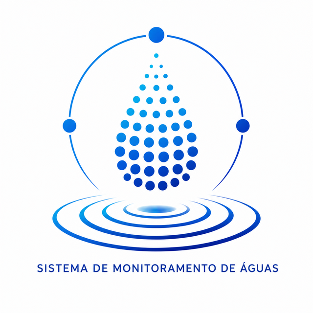

# Sistema de Monitoramento de Águas

Projeto anteriormente identificado como PROTEUS.

## Visão Geral

O Sistema de Monitoramento de Águas é uma plataforma de monitoramento e análise operacional de recursos hídricos. Sua arquitetura foi concebida para apoiar diferentes cenários de monitoramento da qualidade da água, incluindo aplicações ambientais, agrícolas, industriais e de saneamento, por meio de módulos especializados de análise. A Baseline Operacional Inteligente V1 concentra-se na gestão de indicadores de qualidade da água, dados ambientais e consumo/distribuição, constituindo o primeiro núcleo funcional da plataforma.

O projeto foi desenvolvido seguindo a metodologia ICFACTORY, com foco em arquitetura determinística, rastreabilidade, explicabilidade e evolução incremental.

## Objetivos

* Registrar medições operacionais.
* Consolidar informações ambientais.
* Acompanhar consumo e distribuição.
* Produzir relatórios operacionais.
* Identificar tendências observacionais.
* Gerar alertas preventivos.
* Acompanhar eventos operacionais.
* Disponibilizar visão executiva consolidada.

---

# Funcionalidades

## Camada Operacional

### Dashboard

* Resumo geral do sistema.
* Indicadores consolidados.
* Visão rápida das informações cadastradas.

### Qualidade Da Água

* Registro de medições.
* Histórico de medições.
* Verificação de conformidade.

### Dados Ambientais

* Registro de informações ambientais.
* Histórico ambiental.

### Consumo E Distribuição

* Registro de consumo.
* Registro de distribuição.
* Histórico operacional.

### Relatórios Operacionais

* Consolidação das informações registradas.
* Relatórios de apoio operacional.

---

## Camada Analítica

### Previsão Analítica

Recursos disponíveis:

* Tendências de qualidade da água.
* Tendências de consumo.
* Alertas preventivos.
* Water Health Score.

Características:

* Regras determinísticas.
* Sem Machine Learning.
* Resultados explicáveis e auditáveis.

---

## Camada De Governança Operacional

### Governança Operacional

Recursos disponíveis:

* Eventos operacionais.
* Estados observacionais.
* Rastreamento de ocorrências.
* Persistência de eventos.

Estados suportados:

* ABERTO
* MONITORAMENTO
* RESOLVIDO
* ARQUIVADO

Características:

* Sem decisão automática.
* Sem execução operacional automática.
* Acompanhamento observacional.

---

## Camada De Inteligência Executiva

### Painel Executivo

Recursos disponíveis:

* Status executivo observacional.
* Water Health Score consolidado.
* Prioridades observacionais.
* Principais alertas.
* Principais tendências.
* Resumo executivo.

Classificações executivas:

* NORMAL
* ATENCAO
* CRITICO

Características:

* Camada somente leitura.
* Sem automação decisória.
* Síntese executiva dos dados disponíveis.

---

# Arquitetura

Fluxo arquitetural atual:

Observação
→ Relatórios
→ Análise
→ Governança
→ Inteligência Executiva

Camadas implementadas:

* Operacional
* Analítica
* Governança Operacional
* Inteligência Executiva

---

# Estado Atual

## Baseline Operacional Inteligente V1

Status:

APROVADA E CONSOLIDADA

Componentes concluídos:

* GP-A01 Dashboard Summary V1
* GP-A02 Qualidade Da Água
* GP-A03 Dados Ambientais
* GP-A04 Consumo E Distribuição
* GP-A05 Relatórios Operacionais V1
* GP-A06 Analytical Prediction Layer V1
* GP-A07 Operational Governance Layer V1
* GP-A08 Executive Intelligence Layer V1
* GP-A09 Monitoramento Hídrico Modular Base
* GP-A10 Configuração Operacional de Monitoramento Hídrico
* GP-A11 Catálogo Inteligente de Parâmetros Hídricos
* GP-A12 Motor de Avaliação Observacional
* GP-A12A Policy Engine do Monitoramento Hídrico

Características da baseline:

* Arquitetura determinística.
* Arquitetura explicável.
* Arquitetura auditável.
* Sem dependência de Machine Learning.
* Sem dependência de IA generativa.
* Sem ações operacionais automáticas.

---

# Tecnologias

* Python
* PyQt5
* CSV
* JSON
* unittest

---

# Monitoramento Hídrico

GP-A09 inicia a evolução da camada Qualidade Da Água para uma arquitetura base de Monitoramento Hídrico.

Componentes criados:

* Perfis operacionais: Rural, Industrial, Urbano/Saneamento, Ambiental/Rio, ETA e ETE.
* Categorias de parâmetros: Físicos, Químicos, Metais Pesados, Contaminantes Agrícolas, Contaminantes Industriais, Biológicos e Contaminantes Emergentes.
* Catálogo inicial de parâmetros hídricos em JSON.
* Modelos simples e carregadores determinísticos para uso futuro pelas camadas operacional, analítica e executiva.

Características:

* Não altera CSVs existentes.
* Não altera dados operacionais salvos.
* Não implementa validação legal completa nesta etapa.
* Mantém rastreabilidade e evolução incremental aderentes à filosofia ICFACTORY.

GP-A10 adiciona a camada de Configuração Operacional, permitindo que cada operação use o perfil operacional como modelo inicial e habilite categorias e parâmetros conforme cliente, cenário ou necessidade operacional.

Componentes adicionados:

* Modelo `ConfiguracaoOperacional`.
* Serviço `ConfiguracaoOperacionalService`.
* Configurações exemplo para Rural, Industrial, Urbano/Saneamento, Ambiental/Rio, ETA e ETE.
* Persistência de configurações em JSON.
* Validação determinística de perfis, categorias e parâmetros contra o catálogo GP-A09.

GP-A11 enriquece o catálogo de parâmetros hídricos para preparar a futura camada de conformidade.

Metadados adicionados:

* Unidade de medida.
* Tipo de valor.
* Aplicabilidade por perfil operacional.
* Método de análise.
* Frequência recomendada.
* Observações técnicas.
* Limite observacional sem caráter legal completo.

Consultas disponíveis:

* Listagem de parâmetros por perfil operacional.
* Listagem de parâmetros por categoria.
* Obtenção de metadados completos por parâmetro.
* Validação de campos mínimos inteligentes.

GP-A12 adiciona um motor determinístico de avaliação observacional.

Recursos adicionados:

* Modelo `ResultadoAvaliacaoObservacional`.
* Serviço `AvaliacaoObservacionalService`.
* Avaliação de parâmetro e valor com base em `limite_observacional`.
* Status `NORMAL`, `ATENCAO`, `CRITICO` e `NAO_AVALIAVEL`.
* Separação explícita entre avaliação observacional e conformidade legal/normativa futura.

GP-A12A adiciona o Policy Engine do Monitoramento Hídrico.

Princípio arquitetural aplicado:

* PA-01 - Separação entre seleção e execução de políticas.

Recursos adicionados:

* Modelo `PoliticaAvaliacao`.
* Serviço `PolicyEngine`.
* Seleção de política por perfil operacional, categoria e parâmetro.
* Priorização da política mais específica.
* Política observacional padrão quando não houver regra específica.
* Separação explícita: o Policy Engine seleciona política, mas não executa avaliação.

## Estado Congelado

Núcleo de Monitoramento Hídrico - Ciclo Arquitetural 1:

ENCERRADO E CONGELADO

Componentes concluídos:

* Arquitetura modular.
* Configuração operacional.
* Catálogo inteligente.
* Motor de avaliação observacional.
* Policy Engine.
* PA-01 - Separação entre seleção e execução de políticas.

O núcleo passa a existir como base arquitetural estável para auditoria de integração com os módulos já existentes.

GP-A15 inicia a integração do Dashboard ao Núcleo de Monitoramento Hídrico.

Resultado:

* O Dashboard deixa de conter lógica própria hardcoded de avaliação observacional.
* A seleção de política passa a ser feita pelo `PolicyEngine`.
* A execução da avaliação passa a ser feita pelo `AvaliacaoObservacionalService`.
* A leitura de CSVs permanece temporariamente no Dashboard.
* A interface visual é preservada.

---

# Estado do Ciclo AI-02

O ciclo AI-02 foi encerrado técnica e documentalmente em 08/08/2026, com base no commit `2e554439c5e7307fa455fce2420657f2e3b6962d`.

Escopo concluído:

* compartilhamento de dados e perfis;
* integração de Qualidade da Água / Monitoramento Hídrico;
* integração do Dashboard;
* semântica de resultado não avaliável;
* centralização dos limiares de perdas analíticas em `analytics/loss_thresholds.py`, com acompanhamento em 15% e perda alta em 30%.

Evidência de validação: `tests/test_ai02_integration.py` e `tests/test_analytics_loss_thresholds.py`.

Os itens funcionais já registrados no backlog permanecem sem alteração de prioridade. O próximo ciclo e a próxima operação não estão atribuídos.
