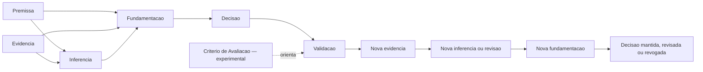

# GP-RG-02 — Modelo Conceitual Da Governanca Da Fundamentacao Das Decisoes

## 1. Identidade E Estado

| Campo | Registro |
|---|---|
| Identificador | GP-RG-02 |
| Natureza | pesquisa e modelagem conceitual documental |
| Objeto | cadeia observavel utilizada para fundamentar decisoes produzidas durante tarefas complexas |
| Estado do modelo | FORMALIZADO PARA PESQUISA — NAO VALIDADO MULTIDOMINIO |
| Hipotese central | H-RG-001 permanece HIPOTESE DE PESQUISA — VALIDACAO PENDENTE |
| Conceito experimental | `Criterio de Avaliacao` permanece HIPOTESE OBSERVACIONAL |

Este documento refina semanticamente o vocabulario constituido pela GP-RG-01. Ele nao altera os registros do experimento fundador, nao descreve raciocinio interno e nao transforma definicoes de trabalho em conclusoes empiricas.

## 2. Objetivo

Definir finalidade, fronteiras, caracteristicas, exemplos, estados e relacoes dos conceitos `Premissa`, `Evidencia`, `Inferencia`, `Fundamentacao`, `Decisao` e `Validacao`, permitindo que registros futuros sejam classificados e auditados com menor ambiguidade.

## 3. Autoridades E Evidencias De Base

| ID | Fonte | Uso nesta GP | Limitacao |
|---|---|---|---|
| E-RG02-001 | `RG_01_RESEARCH_CONSTITUTION.md` | objeto, nao objeto, hipoteses, conceitos iniciais e limites | constituicao, nao validacao empirica |
| E-RG02-002 | `RG_01_RESEARCH_ROADMAP.md` | questoes centrais, gates e criterio de saida da GP-RG-02 | plano prospectivo |
| E-RG02-003 | `RG_01_CLOSURE_REPORT.md` | decisoes, alternativas e recomendacoes herdadas | registra uma etapa documental |
| E-RG02-004 | `PI_07A_DECISION_FOUNDATION_GOVERNANCE_REPORT.md` | exemplos e contraexemplos do caso fundador | um caso, um dominio, sem grupo comparativo |
| E-RG02-005 | diretrizes DG-01 a DG-12 | separacao epistemica e rastreabilidade obrigatoria | ainda nao validadas contra protocolos alternativos |

As definicoes a seguir sao proposicoes conceituais fundamentadas nessas fontes. A sua coerencia interna pode ser auditada nesta GP; utilidade geral, completude e estabilidade somente poderao ser avaliadas por etapas posteriores.

## 4. Convencoes Do Modelo

### 4.1 Unidade Conceitual

A unidade do modelo e um **registro tipado e observavel**. O tipo descreve a funcao documental exercida pelo registro, nao a natureza do arquivo que o contem. Um mesmo documento-fonte pode originar registros distintos, mas cada registro deve possuir um tipo primario inequivoco.

### 4.2 Atributos Comuns Minimos

Todo registro deve possuir, quando aplicavel:

* identificador unico no escopo;
* tipo conceitual;
* enunciado ou conteudo;
* origem e autoria ou agente registrador;
* data ou posicao logica na execucao;
* estado atual;
* referencias aos registros relacionados;
* limitacoes conhecidas;
* historico de revisao sem sobrescrita silenciosa.

Confianca e metodo sao obrigatorios onde definidos por este modelo. Ausencia de um atributo obrigatorio torna o registro incompleto; nao autoriza preencher a lacuna por suposicao.

### 4.3 Estrutura Relacional

A seta indica dependencia ou contribuicao documental, nao causalidade mental. A cadeia pode formar ciclos de revisao e um grafo de referencias. Ela nao e declarada como fluxo interno, estritamente linear ou universal.

## 5. Premissa

### 5.1 Definicao

Proposicao explicitamente adotada como base contextual, normativa, operacional ou provisoria para delimitar uma tarefa ou sustentar elementos posteriores, com origem, justificativa e estado declarados.

### 5.2 Objetivo

Tornar auditaveis as condicoes aceitas antes ou durante a decisao, inclusive aquelas ainda sujeitas a confirmacao.

### 5.3 Caracteristicas Essenciais

* e uma proposicao, nao uma observacao por si so;
* possui origem e motivo de adocao;
* pode ser normativa, contextual, operacional ou provisoria;
* pode ser confirmada, contestada, revisada, rejeitada ou substituida;
* sua validade e limitada ao escopo declarado;
* nao se torna verdadeira apenas por ter sido adotada.

Estados recomendados: `PROPOSTA`, `ATIVA`, `CONFIRMADA`, `CONTESTADA`, `REJEITADA`, `REVISADA` e `SUBSTITUIDA`.

### 5.4 O Que Nao Caracteriza Premissa

* fato observado sem proposicao de adocao;
* resultado de comando tratado como autoexplicativo;
* conclusao derivada de evidencias;
* justificativa completa de uma escolha;
* decisao ja autorizada;
* hipotese cientifica apresentada para teste geral. Uma hipotese pode ser usada como premissa local somente se essa mudanca de papel for explicitada e nao ocultar seu estado hipotetico.

### 5.5 Exemplos

Exemplo positivo: P-003 da GP-PI-07A — nenhuma edicao poderia anteceder a auditoria completa; origem e requisito estavam declarados.

Exemplo de revisao: P-007 foi uma estimativa tipografica provisoria, rejeitada apos E-014 e substituida por P-008.

Contraexemplo: “a legenda ficou legivel” nao e premissa quando resulta de inspecao; pode ser evidencia observacional ou inferencia, conforme o registro e o metodo.

### 5.6 Relacoes E Papel Na Cadeia

Premissas delimitam a interpretacao de evidencias, podem contribuir para inferencias e integram fundamentacoes. Evidencias e validacoes podem contestar seu estado. Sua revisao pode exigir novas inferencias, fundamentacoes ou decisoes, mas nunca apaga o registro anterior.

## 6. Evidencia

### 6.1 Definicao

Registro de dado, evento, artefato ou observacao obtido de fonte identificada por metodo declarado, preservado de forma inspecionavel e acompanhado de alcance, confiabilidade e limitacoes.

### 6.2 Objetivo

Fornecer base observavel verificavel para avaliar premissas, sustentar ou refutar inferencias, compor fundamentacoes e validar resultados.

### 6.3 Caracteristicas Essenciais

* possui fonte e metodo de obtencao;
* distingue conteudo observado de sua interpretacao;
* declara alcance, confiabilidade e limitacoes;
* pode ser reproduzivel, repetivel ou apenas inspecionavel, conforme sua natureza;
* pode sustentar interpretacoes concorrentes;
* sua existencia nao garante relevancia nem suficiencia para uma decisao.

Estados recomendados: `COLETADA`, `ADMITIDA`, `LIMITADA`, `CONTESTADA`, `INVALIDADA` e `SUPERADA`. Invalidacao da admissibilidade nao apaga o registro historico da coleta.

### 6.4 O Que Nao Caracteriza Evidencia

* interpretacao sem dado ou fonte identificavel;
* opiniao apresentada como observacao;
* ausencia de busca apresentada como prova de inexistencia;
* documento citado sem indicar qual conteudo sustenta qual afirmacao;
* inferencia correta ou plausivel renomeada como evidencia;
* volume documental usado como substituto automatico de qualidade.

### 6.5 Exemplos

Exemplo positivo: E-014 da GP-PI-07A — primeira saida e folha de contato, obtidas por renderizacao e inspecao visual, com amostra de quatro frames explicitada.

Exemplo positivo limitado: E-005 confirmou decodificacao da timeline, mas nao aprovacao editorial.

Contraexemplo: “o video esta pronto para publicacao porque decodificou” combina um fato tecnico com uma conclusao editorial; a primeira parte pode ser evidencia, a segunda e inferencia nao sustentada por esse teste isolado.

### 6.6 Relacoes E Papel Na Cadeia

Evidencias podem confirmar ou contestar premissas, sao entrada obrigatoria de inferencias e integram fundamentacoes. Validacoes produzem resultados observaveis que devem ser registrados como novas evidencias antes de alimentar revisoes.

## 7. Inferencia

### 7.1 Definicao

Proposicao interpretativa derivada explicitamente de uma ou mais evidencias identificadas e, quando aplicavel, de premissas declaradas, com regra de derivacao inteligivel, confianca e limitacoes.

### 7.2 Objetivo

Explicitar a passagem entre o observado e o significado atribuido ao observado, impedindo que interpretacoes sejam apresentadas como fatos.

### 7.3 Caracteristicas Essenciais

* referencia ao menos uma evidencia admitida;
* pode depender de premissas, que devem ser citadas;
* declara a conclusao derivada, confianca e limitacoes;
* deve permitir identificar saltos interpretativos;
* pode ser revisada ou rejeitada por nova evidencia;
* nao herda automaticamente a confiabilidade maxima de suas fontes.

Estados recomendados: `PROPOSTA`, `SUSTENTADA`, `CONTESTADA`, `REVISADA`, `REJEITADA` e `SUPERADA`.

### 7.4 O Que Nao Caracteriza Inferencia

* transcricao de observacao sem interpretacao;
* premissa adotada sem derivacao;
* conjunto de referencias sem conclusao explicita;
* decisao ou preferencia;
* afirmacao sem evidencia identificada;
* relato de raciocinio interno nao observavel.

### 7.5 Exemplos

Exemplo positivo: I-007 da GP-PI-07A derivou de E-014 que a primeira configuracao tipografica obstruia conteudo relevante, com confianca e limite restrito ao pipeline.

Exemplo positivo limitado: I-008 interpretou amostras das 12 cenas como suporte a menor obstrucao, sem alegar certificacao editorial integral.

Contraexemplo: “provavelmente o usuario prefere fonte menor” nao e inferencia admissivel sem evidencia sobre preferencia do usuario.

### 7.6 Relacoes E Papel Na Cadeia

Inferencias transformam evidencias em proposicoes interpretativas utilizaveis por fundamentacoes. Uma fundamentacao pode empregar varias inferencias ou, em casos simples, apoiar-se diretamente em evidencia; nenhuma inferencia isolada produz automaticamente uma decisao.

## 8. Fundamentacao

### 8.1 Definicao

Artefato documental composto cuja funcao essencial e relacionar premissas, evidencias, inferencias, alternativas, limitacoes, riscos e justificativa para demonstrar por que uma decisao proposta e suportada no escopo declarado.

### 8.2 Objetivo

Tornar reconstruivel a suficiencia e a proporcionalidade da base de uma decisao, incluindo informacoes contrarias e alternativas razoaveis.

### 8.3 Caracteristicas Essenciais

* e um artefato observavel constituido por relacoes explicitas;
* identifica a decisao proposta ou o problema decisorio;
* possui ao menos uma evidencia admitida;
* distingue evidencias de inferencias;
* inclui premissas aplicaveis, alternativas razoaveis e limitacoes conhecidas;
* registra riscos, impactos e motivo de escolha;
* permite conclusao de insuficiencia ou recomendacao de nao agir.

Estados recomendados: `EM_CONSTRUCAO`, `SUFICIENTE_NO_ESCOPO`, `INSUFICIENTE`, `CONTESTADA`, `REVISADA` e `SUPERADA`.

### 8.4 O Que Nao Caracteriza Fundamentacao

* lista de evidencias sem conexao argumentativa;
* inferencia isolada;
* justificativa retrospectiva que omite alternativas ou falhas;
* decisao repetida em outras palavras;
* alegacao de autoridade sem delimitar seu alcance;
* narrativa selecionada para aparentar coerencia maior que a evidencia disponivel.

### 8.5 Exemplos

Exemplo positivo: a fundamentacao de D-003 conectou P-004/P-005, E-007/E-008/E-012, I-004/I-006, alternativas e riscos para justificar nao gerar voz ou trilha.

Contraexemplo: “nao inserir audio porque parece melhor” e preferencia sem evidencia, alternativas, limites ou risco declarado.

### 8.6 Relacoes E Papel Na Cadeia

Fundamentacao agrega e relaciona os elementos anteriores e e dependencia obrigatoria de uma decisao governada. Ela nao e mero elo textual nem a decisao em si. Nova evidencia ou validacao pode exigir sua revisao.

## 9. Decisao

### 9.1 Definicao

Registro explicito de escolha, autorizacao, rejeicao, manutencao ou nao acao entre alternativas, delimitado por escopo e sustentado por fundamentacao identificada.

### 9.2 Objetivo

Converter uma fundamentacao suficiente no escopo em compromisso governado e auditavel, com responsavel, impacto, risco, confianca e condicoes de revisao.

### 9.3 Caracteristicas Essenciais

* declara o que foi escolhido e o que ficou fora;
* referencia fundamentacao identificavel;
* possui escopo, responsavel ou autoridade e estado;
* registra impacto esperado, riscos e confianca quando houver incerteza relevante;
* pode decidir nao agir por insuficiencia de evidencia;
* pode ser mantida, revisada, revogada ou encerrada sem apagar versoes anteriores.

Estados recomendados: `PROPOSTA`, `AUTORIZADA`, `REJEITADA`, `EXECUTADA`, `MANTIDA`, `REVISADA`, `REVOGADA` e `ENCERRADA`.

### 9.4 O Que Nao Caracteriza Decisao

* preferencia sem autoridade ou compromisso;
* inferencia de que uma opcao parece adequada;
* fundamentacao ainda sem escolha declarada;
* resultado observado apos a execucao;
* acao acidental ou nao registrada;
* conclusao cientifica sobre a eficacia geral da cadeia.

### 9.5 Exemplos

Exemplo positivo: D-001 da GP-PI-07A decidiu preservar o projeto Kdenlive e usar renderizacao nao destrutiva, com alternativas, riscos, confianca e validacao.

Exemplo positivo de nao acao: D-003 decidiu nao gerar voz ou trilha devido a insuficiencia documental e de licenca.

Contraexemplo: “o projeto e renderizavel” e inferencia tecnica, nao escolha.

### 9.6 Relacoes E Papel Na Cadeia

Decisao depende de fundamentacao e define o objeto que sera posteriormente validado. Evidencia nova nao muda a decisao silenciosamente; deve iniciar revisao formal, produzindo decisao revisada, revogada ou mantida.

## 10. Validacao

### 10.1 Definicao

Registro da comparacao entre resultado observado e resultado esperado de uma decisao, usando procedimento e condicoes declarados, com conclusao `APROVADA`, `REJEITADA`, `INCONCLUSIVA` ou qualificacao equivalente acompanhada de ressalvas.

### 10.2 Objetivo

Determinar se o resultado satisfaz o que foi decidido no escopo verificavel e produzir evidencia para manutencao, revisao ou revogacao da cadeia aplicavel.

### 10.3 Caracteristicas Essenciais

* identifica decisao, resultado esperado, resultado observado e procedimento;
* declara alcance, limitacoes e ressalvas;
* preserva resultados negativos e inconclusivos;
* pode confirmar o resultado, rejeita-lo ou exigir revisao;
* gera evidencia nova, mas sua conclusao avaliativa deve permanecer distinguivel dessa evidencia;
* nao apaga a decisao ou a cadeia anterior.

Estados/resultados recomendados: `PLANEJADA`, `EM_EXECUCAO`, `APROVADA`, `APROVADA_COM_RESSALVAS`, `REJEITADA`, `INCONCLUSIVA` e `SUPERADA`.

### 10.4 O Que Nao Caracteriza Validacao

* mera execucao sem comparacao;
* repeticao da decisao como prova de acerto;
* ausencia de erro tecnico tratada como aprovacao de qualidade total;
* confirmacao seletiva que omite resultado contrario;
* garantia de validade geral a partir de um caso;
* alteracao retroativa da decisao original.

### 10.5 Exemplos

Exemplo positivo: a validacao inicial de D-004 foi `REJEITADA` apos E-014; a correcao preservou a tentativa e uma validacao final foi registrada com ressalva.

Exemplo positivo limitado: a decodificacao integral validou integridade tecnica do video, nao compreensao humana ou qualidade editorial definitiva.

Contraexemplo: “foi executado, portanto esta validado” confunde ocorrencia com avaliacao.

### 10.6 Relacoes E Papel Na Cadeia

Validacao avalia o resultado de uma decisao e produz observacoes que devem ingressar como novas evidencias. Pode motivar contestacao ou revisao de premissa, inferencia, fundamentacao e decisao. “Invalidar” significa alterar formalmente o estado vigente, nunca apagar o historico.

## 11. Conceito Experimental — Criterio De Avaliacao

### 11.1 Status Obrigatorio

**HIPOTESE OBSERVACIONAL — NAO INTEGRADO OFICIALMENTE A CADEIA.**

Sua integracao definitiva depende de validacao multidominio. A GP-RG-02 apenas descreve a hipotese sem decidir se ela e conceito autonomo, atributo de Validacao ou parte da Fundamentacao.

### 11.2 Definicao Provisoria

Regra declarada preferencialmente antes da validacao que especifica dimensao avaliada, metodo, limiar ou condicao e interpretacao dos resultados possiveis.

### 11.3 Objetivo Experimental

Reduzir ajuste retrospectivo do julgamento e tornar explicito o que significa aprovar, rejeitar ou considerar inconclusivo um resultado.

### 11.4 Caracteristicas Observadas

* relaciona-se diretamente com Validacao;
* pode ser informado por requisitos da Decisao e limites da Fundamentacao;
* deve possuir origem, momento de definicao e regra de aplicacao;
* revisao posterior deve ser identificada e nao aplicada retroativamente sem justificativa;
* sua autonomia semantica ainda nao foi demonstrada.

### 11.5 O Que Nao Caracteriza O Conceito

* preferencia criada apos conhecer o resultado para favorecer aprovacao;
* evidencia coletada;
* conclusao da validacao;
* garantia de qualidade;
* integrante definitivo da cadeia nesta etapa.

### 11.6 Exemplos E Ambiguidade Aberta

Exemplo positivo provisório: “o projeto-fonte deve manter SHA-256 identico antes e depois” funciona como regra verificavel para a validacao de preservacao.

Contraexemplo: “o resultado parece bom” nao define dimensao, metodo ou condicao de aceitacao.

Ambiguidade: a regra pode ser modelada como atributo da Validacao ou como restricao derivada da Fundamentacao. Nao ha evidencia multidominio suficiente para escolher uma dessas interpretacoes como definitiva.

## 12. Regras Conceituais Formais

| ID | Regra | Consequencia de violacao |
|---|---|---|
| RC-01 | cada registro possui um tipo conceitual primario | classificacao ambigua; exigir desmembramento ou justificativa |
| RC-02 | toda Premissa declara origem, motivo e estado | premissa incompleta |
| RC-03 | toda Evidencia declara fonte, metodo, alcance e limitacoes | evidencia inadmissivel ate complementacao |
| RC-04 | Evidencia nunca deve ser apresentada como Inferencia, nem Inferencia como Evidencia | violacao da separacao epistemica |
| RC-05 | toda Inferencia referencia ao menos uma Evidencia admitida | inferencia sem suporte; estado REJEITADA ou INCOMPLETA |
| RC-06 | toda Inferencia declara premissas aplicaveis, confianca e limitacoes | derivacao nao auditavel |
| RC-07 | toda Decisao referencia uma Fundamentacao | decisao nao governada |
| RC-08 | toda Fundamentacao possui ao menos uma Evidencia e explicita suas relacoes | fundamentacao insuficiente |
| RC-09 | alternativas razoaveis e informacoes contrarias nao podem ser omitidas | fundamentacao seletiva e invalida para governanca |
| RC-10 | uma Validacao identifica a Decisao e separa resultado observado de conclusao avaliativa | validacao nao auditavel |
| RC-11 | uma Validacao pode motivar invalidacao ou revisao formal de outros registros | exigir transicao de estado rastreavel |
| RC-12 | toda revisao preserva identificador, estado e conteudo anterior ou referencia imutavel a eles | perda de rastreabilidade |
| RC-13 | ausencia de evidencia deve ser registrada como insuficiencia | vedada substituicao por hipotese apresentada como fato |
| RC-14 | nenhum elo produz automaticamente o elo seguinte | exige ato documental explicito e autoridade aplicavel |
| RC-15 | referencias circulares nao podem ser a unica sustentacao de uma cadeia | cadeia insuficiente |
| RC-16 | confianca refere-se ao alcance declarado, nao a certeza universal | exigir revisao do enunciado |
| RC-17 | resultado negativo ou inconclusivo integra o historico | vedada remocao seletiva |
| RC-18 | `Criterio de Avaliacao` permanece experimental ate validacao multidominio e decisao formal | vedada integracao oficial antecipada |

## 13. Cardinalidades Conceituais Provisorias

| Relacao | Cardinalidade minima | Observacao |
|---|---:|---|
| Evidencia → Inferencia | 1:N | uma inferencia exige uma ou mais evidencias; uma evidencia pode suportar varias inferencias |
| Premissa → Inferencia | 0:N | premissa e opcional quando a derivacao nao depende de condicao adotada |
| Evidencia → Fundamentacao | 1:N | toda fundamentacao exige evidencia; uma evidencia pode integrar varias fundamentacoes |
| Inferencia → Fundamentacao | 0:N | inferencia nao e obrigatoria em decisoes diretamente suportadas por evidencia |
| Fundamentacao → Decisao | 1:N | toda decisao exige ao menos uma fundamentacao identificada; uma fundamentacao pode sustentar decisoes relacionadas se o escopo for explicito |
| Decisao → Validacao | 1:N quando executavel | decisoes ainda nao executadas podem aguardar validacao; nao acao pode ser validada quanto ao cumprimento da restricao |
| Validacao → nova Evidencia | 1:N | resultados observados da validacao entram no ciclo como evidencias novas |

As cardinalidades sao decisoes de modelagem desta GP, com confianca media. Elas devem ser testadas na GP-RG-03 e nao constituem arquitetura de software.

## 14. Invariantes

1. Nenhuma decisao governada existe sem fundamentacao identificavel.
2. Nenhuma inferencia admissivel existe sem evidencia identificada.
3. Evidencia e inferencia permanecem semanticamente distintas mesmo quando registradas no mesmo documento.
4. Revisao nunca elimina o estado anterior.
5. Validacao negativa nao e falha documental quando registrada integralmente.
6. Rastreabilidade nao prova correcao da decisao.
7. Observabilidade documental nao equivale a acesso a estados internos.
8. Uma cadeia incompleta deve ser declarada incompleta.
9. `Criterio de Avaliacao` nao e setimo elo oficial nesta versao.

## 15. Hipoteses E Estados Preservados

| Hipotese | Estado apos GP-RG-02 |
|---|---|
| H-RG-001 | VALIDACAO PENDENTE |
| H-RG-002 | SUSTENTADA EM UM CASO; NAO VALIDADA |
| H-RG-003 | SUSTENTADA EM UM CASO; NAO VALIDADA |
| H-RG-004 | PENDENTE |
| H-RG-005 | PENDENTE |
| H-RG-006 | PENDENTE |
| H-RG-007 | PENDENTE |
| autonomia de `Criterio de Avaliacao` | HIPOTESE OBSERVACIONAL |

## 16. Limitacoes Do Modelo

* derivado de um unico experimento fundador;
* exemplos concentrados no dominio audiovisual e documental;
* nenhuma replicacao independente;
* nenhuma comparacao com vocabularios alternativos;
* cardinalidades ainda nao testadas em casos complexos;
* fronteira de `Criterio de Avaliacao` permanece aberta;
* estados recomendados ainda nao foram submetidos a protocolo;
* o modelo nao mede qualidade decisoria nem custo documental;
* o modelo nao representa raciocinio interno, cognicao ou arquitetura de modelos;
* coerencia conceitual nesta GP nao equivale a validacao empirica.

## 17. Conclusao

Os seis conceitos obrigatorios possuem definicao, objetivo, fronteira, exemplos, relacoes, estados e papel documental. O modelo adota uma cadeia em grafo com ciclos explicitos de revisao, preservando a distincao entre registro observavel e processo interno nao observavel.

`Criterio de Avaliacao` permanece separado como hipotese observacional. Nenhuma hipotese da familia GP-RG foi promovida a conclusao.

## 18. Estado Final

**MODELO CONCEITUAL FORMALIZADO — VALIDACAO EMPIRICA PENDENTE**
