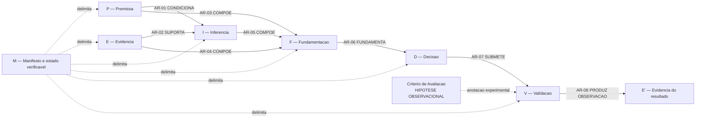
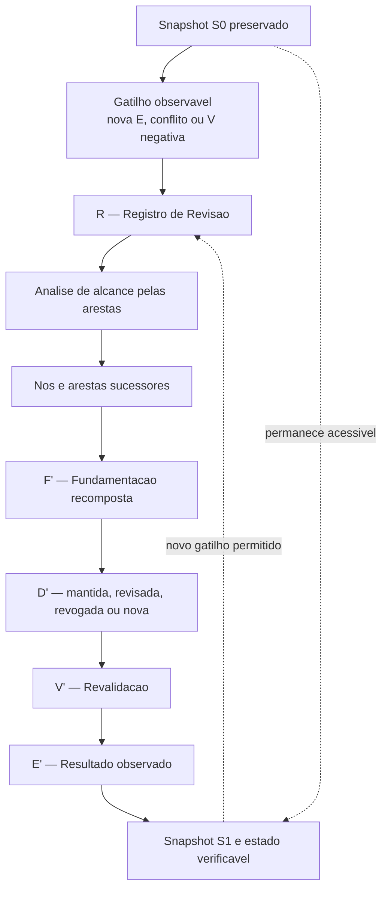
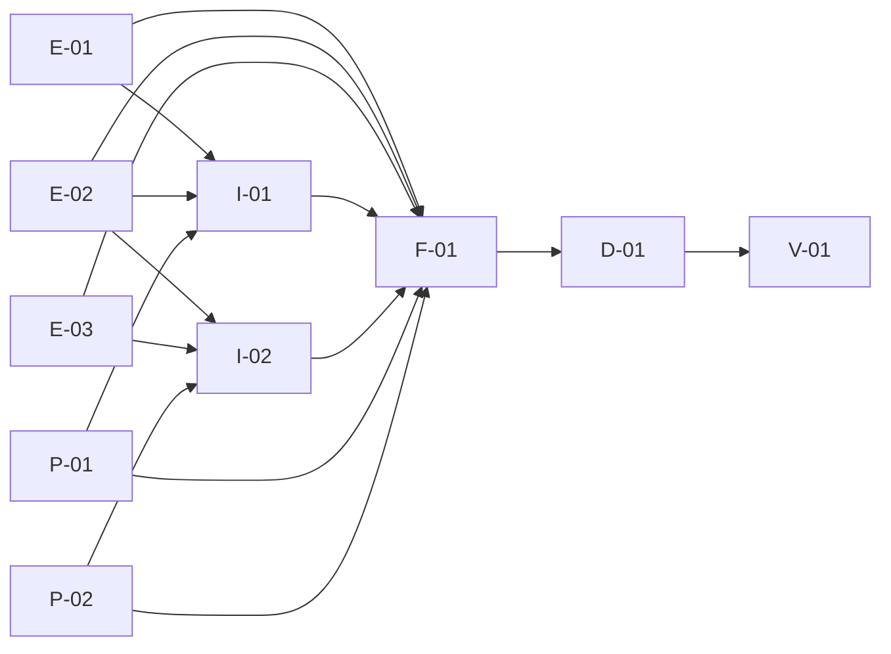
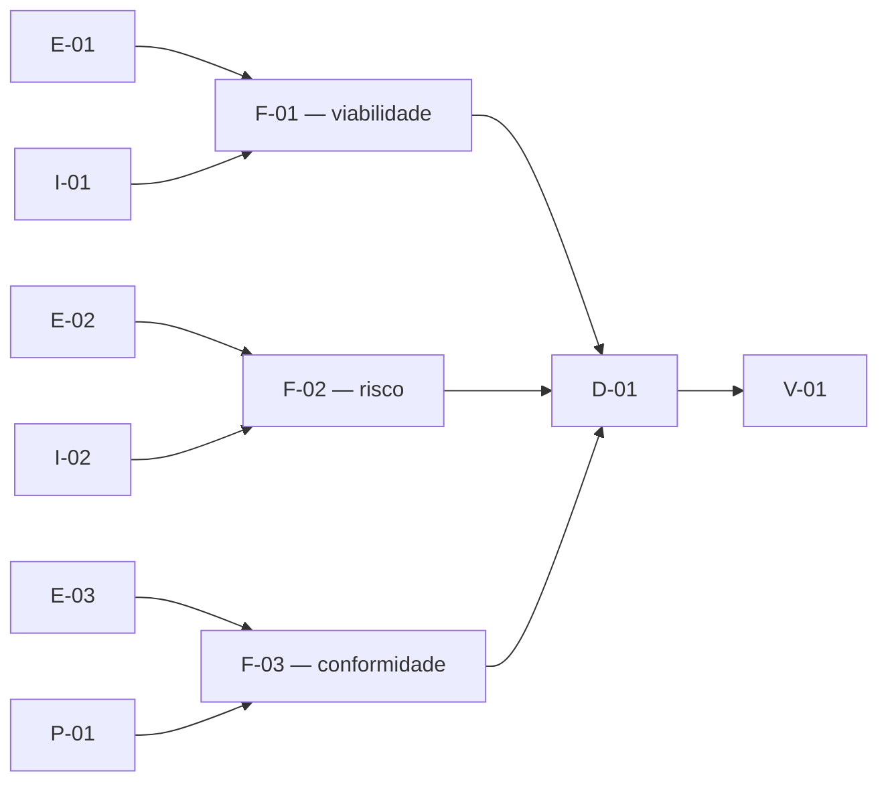
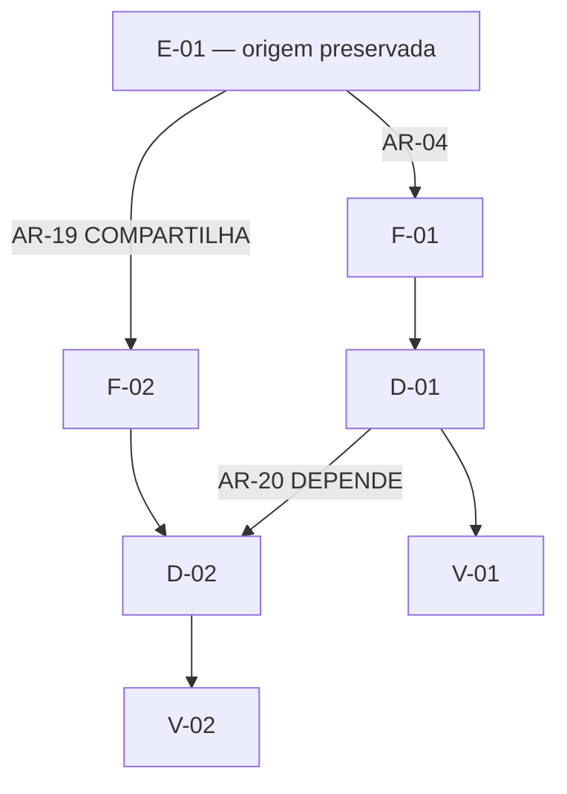
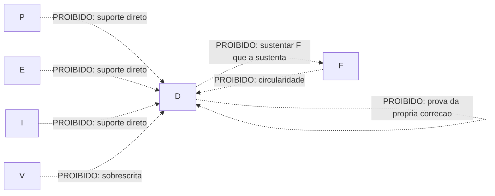
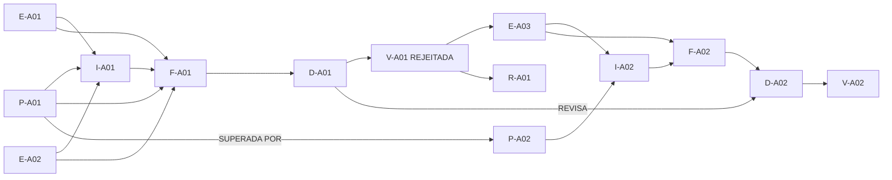

# GP-RG-03 — Representacao Arquitetural Da Cadeia

## 1. Objetivo E Notacao

Representar visualmente a arquitetura GDC-R definida em `RG_03_ARCHITECTURE.md`. Os diagramas sao vistas do mesmo modelo documental; nao sao fluxos cognitivos nem arquitetura de software.

| Simbolo | Significado |
|---|---|
| P | Premissa |
| E | Evidencia |
| I | Inferencia |
| F | Fundamentacao |
| D | Decisao |
| V | Validacao |
| R | Registro estrutural de Revisao, nao conceito epistemico |
| M | Manifesto estrutural da cadeia |
| linha continua | relacao oficial tipada |
| linha tracejada | anotacao, contexto ou conceito experimental |
| no cinza | versao historica preservada |

O conteudo das instancias pode pertencer a qualquer dominio. Nenhum diagrama exige PROTEUS, ICFACTORY, software, IA ou tipo especifico de decisor.

## 2. Vista Estrutural Principal

Leitura: P e I sao opcionais no Perfil Minimo Governado quando genuinamente nao aplicaveis; E, F e D sao obrigatorios para uma decisao governada. V e obrigatoria quando concluida e deve estar pendente de forma explicita enquanto o resultado ainda nao existir.

## 3. Vista Do Ciclo Controlado De Revisao

O retorno somente e permitido entre snapshots versionados. Um ciclo de sustentacao dentro do mesmo snapshot e proibido.

## 4. Vista De Multiplas Evidencias E Inferencias

Propriedades demonstradas estruturalmente:

* uma Evidencia pode suportar varias Inferencias;
* uma Inferencia pode depender de varias Evidencias;
* Fundamentacao pode agregar entradas heterogeneas;
* compartilhamento nao elimina origem, metodo ou limitacoes individuais.

## 5. Vista De Multiplas Fundamentacoes

Uma Decisao pode receber varias Fundamentacoes complementares. Se forem conflitantes, D deve registrar o conflito e o motivo da escolha; a multiplicidade nao pode ser usada para ocultar divergencia.

## 6. Vista De Decisoes Dependentes E Reutilizacao Controlada

Cada Decisao conserva Fundamentacao propria. A dependencia D-01→D-02 nao substitui F-02→D-02.

## 7. Vista De Relacoes Proibidas

Essas arestas nao pertencem ao GDC-R. Quando uma fonte contem texto misto, seus registros devem ser desmembrados e tipados.

## 8. Exemplo Completo A — Revisao Por Validacao Negativa

Exemplo documental abstrato, inspirado apenas na forma do caso fundador e independente de dominio:

1. `P-A01`: condicao operacional inicial e adotada.
2. `E-A01` e `E-A02`: observacoes obtidas por metodos declarados.
3. `I-A01`: interpretacao sustentada por ambas as evidencias.
4. `F-A01`: agrega premissa, evidencias, inferencia, alternativas e riscos.
5. `D-A01`: autoriza uma opcao.
6. `V-A01`: compara resultado esperado e observado; resultado `REJEITADA`.
7. `E-A03`: registra o resultado negativo observado.
8. `R-A01`: abre revisao e congela o snapshot anterior.
9. `P-A02`: substitui P-A01 com motivo rastreado.
10. `I-A02`: deriva nova interpretacao de E-A03 e demais evidencias aplicaveis.
11. `F-A02`: recomposta sem apagar F-A01.
12. `D-A02`: revisa D-A01.
13. `V-A02`: revalida o resultado e encerra em estado verificavel.

## 9. Exemplo Completo B — Multiplas Fundamentacoes E Nao Acao

Exemplo hipotetico aplicavel a auditoria, pesquisa, gestao, software ou decisao humana:

* `E-B01`: dado de viabilidade;
* `E-B02`: dado de risco;
* `E-B03`: dado de conformidade;
* `I-B01`: viabilidade parcial;
* `I-B02`: risco material nao mitigado;
* `F-B01`: fundamentacao tecnica favoravel;
* `F-B02`: fundamentacao de risco desfavoravel;
* `F-B03`: fundamentacao de conformidade inconclusiva;
* `D-B01`: nao executar por enquanto, declarando condicoes para revisao;
* `V-B01`: confirma que nenhuma execucao ocorreu e mantem estado `ENCERRADA_SEM_ACAO`, com pendencia registrada.

O exemplo mostra que multiplas Fundamentacoes nao precisam convergir e que uma Decisao governada pode ser nao acao. Ele nao demonstra eficacia empirica da arquitetura.

## 10. Exemplo De Independencia De Dominio

| Dominio possivel | Conteudo de P/E/I/F/D/V | Elementos GDC-R alterados? |
|---|---|---|
| desenvolvimento de software | requisitos, testes, interpretacao, justificativa, decisao de release, validacao | nao |
| auditoria | criterios normativos, achados, analise, parecer, decisao, verificacao posterior | nao |
| pesquisa cientifica | condicoes, observacoes, analise, justificativa, decisao experimental, validacao | nao |
| gestao de projetos | restricoes, indicadores, projecoes, justificativa, priorizacao, revisao de resultado | nao |
| decisao humana | contexto declarado, registros disponiveis, interpretacao, ponderacao, escolha, revisao | nao |
| sistema assistido por IA | entradas observaveis, saidas verificadas, inferencias declaradas, suporte, decisao autorizada, validacao | nao |

Esta tabela demonstra neutralidade semantica do desenho, nao aplicabilidade empirica comprovada nos dominios listados.

## 11. Criterio De Avaliacao Experimental

A linha tracejada indica que a anotacao nao integra o conjunto oficial de nos. Sua ocorrencia na modelagem e evidencia adicional de utilidade potencial, nao promocao conceitual.

## 12. Limites Da Representacao

* diagramas omitem campos para preservar legibilidade;
* setas representam relacoes documentais, nao causalidade mental;
* exemplos abstratos nao sao experimentos;
* neutralidade estrutural nao prova adequacao em todos os dominios;
* multiplicidade e ciclos ainda requerem teste no protocolo GP-RG-04;
* nenhuma vista define formato fisico, banco de dados ou implementacao.

## 13. Estado Final

**REPRESENTACAO GDC-R FORMALIZADA — EXEMPLOS NAO EMPIRICOS**
