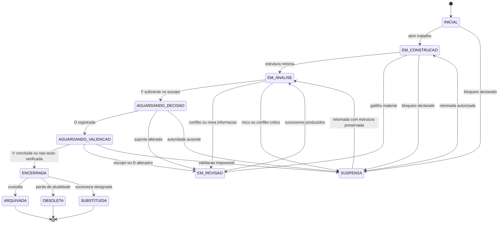

# GP-RG-04 — Modelo Dinamico Da Arquitetura GDC-R

## 1. Identidade E Estado

| Campo | Registro |
|---|---|
| Identificador | GP-RG-04 |
| Natureza | modelagem dinamica exclusivamente documental |
| Arquitetura de base | GDC-R — Grafo Dirigido de Governanca com Revisoes Controladas |
| Estado | MODELO DINAMICO FORMALIZADO — VALIDACAO EMPIRICA PENDENTE |
| Escopo | evolucao temporal de cadeias, snapshots, estados, dependencias, propagacoes e encerramentos |
| Nao objeto | execucao de protocolo, validacao multidominio, arquitetura de software ou funcionamento interno de agentes |
| Generalidade | DGA-01 preservada integralmente |

## 2. Objetivo

Definir como uma instancia GDC-R nasce, evolui, estabiliza, entra em revisao, propaga alteracoes, trata conflitos, preserva versoes e termina em estado documental verificavel.

O modelo descreve comportamento permitido e proibido. Nao demonstra que esse comportamento seja eficiente, suficiente, reproduzivel ou adequado a todos os dominios.

## 3. Autoridades E Evidencias

| ID | Artefato | Contribuicao | Limitacao |
|---|---|---|---|
| E-RG04-001 | `RG_01_RESEARCH_CONSTITUTION.md` | objeto, principios, limites e hipoteses | constituicao, nao dinamica testada |
| E-RG04-002 | `RG_01_RESEARCH_ROADMAP.md` | sequencia original e gates | planejamento anterior a autorizacao atual |
| E-RG04-003 | `RG_02_CONCEPTUAL_MODEL.md` | estados conceituais e regras RC-01 a RC-18 | nao validado multidominio |
| E-RG04-004 | `RG_02_SEMANTIC_MATRIX.md` | revisibilidade e ambiguidades | classificacao independente nao testada |
| E-RG04-005 | `RG_03_ARCHITECTURE.md` | GDC-R, estados verificaveis, relacoes AR e ciclo de revisao | arquitetura estatica/documental |
| E-RG04-006 | `RG_03_ARCHITECTURAL_DIAGRAM.md` | vistas de revisao, paralelismo e convergencia | exemplos nao empiricos |
| E-RG04-007 | `RG_03_INVARIANTS.md` | INV-01 a INV-31 | severidades nao calibradas |
| E-RG04-008 | `RG_03_CLOSURE_REPORT.md` | decisoes arquiteturais e recomendacoes | recomendava protocolo experimental como proxima etapa |
| E-RG04-009 | autorizacao atual GP-RG-04 | redefine expressamente a etapa como Dinamica GDC-R | nao delibera renumeracao do protocolo ou escopo RG-05 |

## 4. Premissas Da Dinamica

| ID | Premissa | Origem | Estado |
|---|---|---|---|
| P-RG04-001 | snapshots publicados sao imutaveis | INV-16/17/19 | ADOTADA |
| P-RG04-002 | mudanca material ocorre por nova versao e Registro de Revisao | GDC-R secao 9 | ADOTADA |
| P-RG04-003 | propagacao nao equivale a invalidacao automatica | GDC-R secao 9.3 | ADOTADA |
| P-RG04-004 | estados negativos, pendentes e inconclusivos sao verificaveis | GDC-R secao 5.5 | ADOTADA |
| P-RG04-005 | dependencia e criticidade devem ser declaradas, nao presumidas | RI/INV de integridade | ADOTADA |
| P-RG04-006 | DGA-01 impede estados ou transicoes dependentes de dominio | diretriz DGA-01 | ADOTADA |
| P-RG04-007 | nenhuma hipotese pode ser promovida nesta etapa | autorizacao GP-RG-04 | ADOTADA |

## 5. Unidade Temporal

### 5.1 Snapshot

Um **snapshot** e uma vista imutavel de `C = (M,N,A,R,S)` em uma ordem logica identificada. Ele contem:

* versao da cadeia;
* estado composto;
* nos e arestas vigentes;
* registros historicos referenciados;
* conflitos e pendencias;
* classe de conformidade;
* limitacoes conhecidas.

“Tempo” pode ser data, sequencia, evento ou ordem logica. Nenhuma tecnologia de relogio e exigida.

### 5.2 Evento De Evolucao (`EV`)

Controle estrutural que registra uma ocorrencia capaz de alterar o estado futuro. Nao e novo conceito epistemico.

Campos minimos:

* `event_id`;
* cadeia e versao de origem;
* tipo de evento;
* origem observavel;
* agente ou autoridade registradora;
* elementos inicialmente afetados;
* ordem logica;
* confianca e limitacoes quando aplicaveis.

### 5.3 Registro De Impacto (`IM`)

Controle estrutural derivado da analise de propagacao.

Campos minimos:

* `impact_id` e `event_id`;
* elemento afetado;
* caminho de dependencia;
* intensidade (`NENHUM`, `REVISAR`, `SUSPENDER_APLICABILIDADE`, `RETIRAR_SUPORTE_ATUAL`, `INCONCLUSIVO`);
* obrigatoriedade de reavaliacao;
* justificativa;
* estado de resolucao.

EV e IM complementam o Registro de Revisao `R`; nao integram `{P,E,I,F,D,V}`.

## 6. Estado Composto Da Cadeia

Um estado dinamico e a tupla:

`Ω(C,t) = (L, Q, K, X)`

Onde:

* `L` = estado de ciclo de vida;
* `Q` = estado de verificacao/validacao;
* `K` = estado de estabilidade;
* `X` = classe de conformidade GDC-R.

Essa decomposicao evita tratar “VALIDADA”, “ARQUIVADA” e “ESTAVEL” como estados mutuamente exclusivos quando representam dimensoes diferentes.

### 6.1 Dimensao De Ciclo De Vida (`L`)

| Estado | Definicao | Justificativa documental |
|---|---|---|
| `INICIAL` | Manifesto criado; nenhum snapshot substantivo consolidado | identifica nascimento sem presumir conteudo |
| `EM_CONSTRUCAO` | nos/arestas em formacao e lacunas declaradas | preserva estado RG-03 |
| `EM_ANALISE` | estrutura minima existe e esta sendo examinada quanto a suporte/conflitos | separa coleta de avaliacao |
| `AGUARDANDO_DECISAO` | Fundamentacao disponivel; ato decisorio pendente | preserva estado RG-03 |
| `AGUARDANDO_VALIDACAO` | Decisao registrada; resultado ainda nao avaliado | preserva estado RG-03 |
| `EM_REVISAO` | R aberto; impacto e sucessores em elaboracao | preserva estado RG-03 |
| `SUSPENSA` | evolucao ou aplicabilidade temporariamente interrompida com motivo | evita continuar sob risco/conflito sem encerrar historia |
| `ENCERRADA` | trabalho documental corrente terminou em estado verificavel | permite fechamento positivo, negativo, inconclusivo ou sem acao |
| `ARQUIVADA` | cadeia encerrada sob custodia somente leitura | distingue encerramento logico de custodia |
| `OBSOLETA` | cadeia preservada, mas nao recomendada para uso corrente | registra perda de atualidade sem apagar |
| `SUBSTITUIDA` | outra cadeia/versao foi designada sucessora | preserva vinculo de sucessao |

`ARQUIVADA`, `OBSOLETA` e `SUBSTITUIDA` sao terminais para mutacao daquela versao. Nova atividade ocorre em sucessora identificada.

### 6.2 Dimensao De Verificacao (`Q`)

| Estado | Definicao |
|---|---|
| `NAO_AVALIADA` | nenhuma Validacao concluida aplicavel |
| `PARCIALMENTE_VALIDADA` | parte delimitada das Decisoes/escopo possui V concluida |
| `VALIDADA_APROVADA` | V aprovou o escopo declarado |
| `VALIDADA_COM_RESSALVAS` | V aprovou com limites materiais |
| `VALIDADA_REJEITADA` | V rejeitou o resultado |
| `VALIDACAO_INCONCLUSIVA` | evidencia nao permitiu conclusao |
| `VERIFICADA_SEM_ACAO` | decisao governada de nao agir foi verificada |

“Validada” sempre exige escopo, versao e V identificada. Nao significa validade universal.

### 6.3 Dimensao De Estabilidade (`K`)

| Estado | Criterios documentais |
|---|---|
| `INSTAVEL` | conflito critico, R aberto, dependencia forte rompida ou violacao bloqueante |
| `EM_OBSERVACAO` | invariantes essenciais atendidos, mas ha validacao, conflito nao critico ou evidencia limitada pendente |
| `ESTAVEL` | sem R aberto, sem conflito material nao tratado, invariantes aplicaveis atendidos e suporte vigente das D consistente |
| `CONGELADA` | snapshot deliberadamente bloqueado para mudanca; nova informacao gera ramo/sucessora |
| `CONSOLIDADA` | ESTAVEL, ENCERRADA, auditada no perfil declarado e designada como referencia documental |

Consolidacao e estabilidade documental nao equivalem a confirmacao das hipoteses de pesquisa.

### 6.4 Dimensao De Conformidade (`X`)

Preserva as classes RG-03: `CONFORME`, `CONFORME_COM_RESSALVAS`, `INCOMPLETA`, `INCONSISTENTE` e `NAO_CONFORME`.

## 7. Ciclo De Vida Geral

Transicoes detalhadas constam em `RG_04_STATE_MACHINE.md`.

## 8. Governanca Da Evolucao

Toda mudanca material segue:

1. detectar e registrar EV;
2. verificar autoridade e escopo;
3. congelar snapshot de origem;
4. abrir R quando a mudanca afetar conteudo, estado ou relacao;
5. classificar dependencias e caminhos transitivos;
6. produzir IM para cada elemento alcançado;
7. reavaliar dependentes obrigatorios;
8. criar sucessores sem sobrescrita;
9. recompor F e registrar D nova/mantida/revista/revogada quando aplicavel;
10. produzir V nova quando houver resultado;
11. verificar invariantes estaticos e dinamicos;
12. publicar novo snapshot e `Ω`;
13. encerrar ou manter R com pendencias explicitas.

Autoridade para registrar evento nao implica autoridade para alterar Decisao. Papeis podem ser exercidos por pessoa, instituicao, sistema ou arranjo assistido, desde que observavelmente declarados.

## 9. Tipos De Evolucao

| Tipo | Descricao | Efeito de versao |
|---|---|---|
| evolucao normal | adiciona registros previstos sem romper suporte vigente | revisao menor ou snapshot intermediario |
| revisao parcial | altera subconjunto delimitado; D pode ser mantida | versao menor, se compatibilidade preservada |
| revisao total | escopo, suporte central ou D muda materialmente | versao maior |
| suspensao | interrompe aplicabilidade/evolucao sem encerrar | nova revisao de estado |
| congelamento | impede alteracao do snapshot designado | sucessora ou ramo para qualquer mudanca |
| consolidacao | designa versao estavel e auditada como referencia | nova versao de estado, sem promover hipoteses |
| obsolescencia | retira recomendacao de uso corrente | estado terminal com motivo |
| substituicao | liga predecessor a sucessora | versao/cadeia sucessora obrigatoria |
| arquivamento | transfere para custodia somente leitura | estado terminal custodial |

## 10. Versionamento Documental

### 10.1 Identificacao

Versao recomendada: `vMAJOR.MINOR`, acompanhada por `snapshot_id` e ordem logica de eventos.

### 10.2 Revisao Menor

Incrementa `MINOR` quando:

* escopo e identidade da cadeia permanecem;
* Decisao vigente e mantida ou apenas esclarecida sem mudar compromisso;
* novas E/I/F nao retiram suporte central;
* compatibilidade de interpretacao e preservada;
* historico e impacto estao registrados.

### 10.3 Revisao Maior

Incrementa `MAJOR` quando houver pelo menos um:

* mudanca material de escopo ou perfil;
* Decisao revista, revogada ou substituida;
* perda do ultimo suporte valido de D;
* redefinicao estrutural necessaria;
* incompatibilidade semantica com consumidores documentais anteriores;
* convergencia de cadeias que cria nova identidade.

### 10.4 Compatibilidade

| Classe | Condicao |
|---|---|
| `COMPATIVEL` | consumidores podem reconstruir a nova versao com as mesmas definicoes e vinculos principais |
| `COMPATIVEL_COM_RESSALVAS` | parte do suporte/estado mudou, mas rastreabilidade e significado central permanecem |
| `INCOMPATIVEL` | escopo, D, semantica ou estrutura mudou materialmente; requer adaptacao explicita |

Incompatibilidade nao apaga nem corrompe a versao anterior. Cada versao declara predecessor, motivo, classe de compatibilidade e mapa de elementos mantidos, substituidos, adicionados e retirados de vigencia.

## 11. Estabilidade Documental

### 11.1 Estavel

Uma cadeia e `ESTAVEL` quando, no snapshot:

* nao ha R aberto material;
* dependencias fortes e criticas resolvem;
* nao ha conflito material oculto;
* invariantes bloqueantes e altos aplicaveis estao atendidos;
* D vigentes conservam F e E ativas;
* estado e limitacoes sao coerentes.

### 11.2 Instavel

E `INSTAVEL` quando qualquer condicao acima falha materialmente. Instabilidade deve ser localizada e nao autoriza apagar partes estaveis.

### 11.3 Em Observacao

E `EM_OBSERVACAO` quando nao ha violacao bloqueante, mas existem pendencias de V, evidencias limitadas, conflitos nao criticos ou periodo/logica de acompanhamento ainda aberto.

### 11.4 Congelada

E `CONGELADA` por decisao formal de custodia ou baseline. O snapshot nao muda; nova informacao e registrada em ramo ou sucessora.

### 11.5 Consolidada

E `CONSOLIDADA` quando ESTAVEL, ENCERRADA, auditada no perfil declarado, com historico e limitacoes completos, e formalmente designada como referencia. Nao significa empiricamente correta ou universal.

## 12. Tratamento De Conflitos

Nenhuma estrategia abaixo e promovida como definitiva. A escolha depende de escopo, autoridade, risco e evidencia e deve ser fundamentada.

| Conflito | Registro minimo | Estrategias candidatas | Efeito enquanto aberto |
|---|---|---|---|
| entre Evidencias | AR-16, fontes, metodos, escopos e confianca | repetir coleta; auditar metodo; particionar escopo; manter ambas; buscar terceira fonte | I/F dependentes em reavaliacao; critico pode suspender D |
| entre Inferencias | evidencias/premissas e regras de derivacao de cada I | revisao independente; distinguir escopos; manter alternativas; coletar nova E | F deve declarar divergencia |
| entre Fundamentacoes | elementos, alternativas, riscos e criterios de suficiencia | ponderacao fundamentada; decisao por autoridade; decompor D; suspender | D nao pode ocultar conflito material |
| entre Decisoes | autoridades, escopos, dependencias e ordem logica | precedencia de escopo/autoridade; coexistencia segmentada; revisao; sucessao | aplicabilidade deve ser explicitada |
| entre Validacoes | D/versao, metodo, amostra, resultado e limite | revalidar; comparar metodo; separar escopo; declarar inconclusiva | Q nao pode ser unificado artificialmente |

Conflito critico e aquele que remove suporte minimo, produz estados incompatíveis ou afeta Decisao vigente de alto impacto. Sua abertura leva `K=INSTAVEL` e pode levar `L=SUSPENSA`.

## 13. Cadeias Paralelas E Convergentes

### 13.1 Paralelas

Duas cadeias podem evoluir em paralelo quando possuem Manifestos e escopos proprios. Compartilhamento usa AR-19 e conserva proveniencia. Uma nao herda automaticamente estado, validade ou Decisao da outra.

### 13.2 Convergentes

Convergencia nao funde historicos por sobrescrita. Cria nova cadeia/versao maior que:

* referencia todas as cadeias-fonte;
* preserva IDs e versoes de origem;
* declara conflitos e elementos selecionados;
* possui F e D proprias;
* registra compatibilidade e limitacoes;
* nao altera as fontes.

## 14. Propriedades Dinamicas

| Propriedade | Definicao operacional | Evidencia documental minima | Limite conhecido |
|---|---|---|---|
| Persistencia | estados anteriores continuam acessiveis apos evolucao | snapshots, predecessores e historico | tecnologia de custodia nao definida |
| Propagacao | impacto percorre dependencias segundo regras declaradas | EV, caminhos e IM | precisao ainda nao testada |
| Resiliencia documental | conflito/falha localizada nao apaga partes nao afetadas | isolamento de impacto e estados parciais | recuperacao operacional nao testada |
| Recuperabilidade | estado anterior pode ser reconstruido sem reverter historia | snapshot imutavel e mapa de versoes | nao garante restauracao tecnica de sistema |
| Observabilidade | toda transicao possui origem, agente, motivo e resultado inspecionaveis | EV, R, IM e snapshot | nao revela estado interno de agente |
| Evolutividade | novos registros e sucessoras podem ser incorporados sem destruir predecessores | versionamento e relacoes de sucessao | custo e escalabilidade desconhecidos |
| Estabilidade | ausencia documentada de revisao/conflito material e suporte vigente coerente | criterios K e auditoria de invariantes | estabilidade pode ser temporaria |
| Consistencia temporal | estados e Decisoes sao interpretados conforme versao e ordem logica corretas | timestamps/ordem, compatibilidade e vigencia | simultaneidade real pode exigir extensao |

## 15. Invariantes Dinamicos

| ID | Invariante | Severidade |
|---|---|---|
| ID-RG04-01 | toda alteracao material possui EV com origem documentada | BLOQUEANTE |
| ID-RG04-02 | snapshot publicado e imutavel | BLOQUEANTE |
| ID-RG04-03 | toda nova versao referencia predecessor ou declara origem inicial | BLOQUEANTE |
| ID-RG04-04 | toda transicao pertence ao catalogo permitido ou produz nao conformidade | BLOQUEANTE |
| ID-RG04-05 | toda transicao declara autoridade, motivo e ordem logica | BLOQUEANTE |
| ID-RG04-06 | toda propagacao possui IM e caminho de dependencia | BLOQUEANTE |
| ID-RG04-07 | dependencia forte alterada exige reavaliacao do dependente | BLOQUEANTE |
| ID-RG04-08 | dependencia critica rompida torna K INSTAVEL e suspende aplicabilidade quando material | BLOQUEANTE |
| ID-RG04-09 | retirada significa mudanca de vigencia, nunca exclusao fisica/historica | BLOQUEANTE |
| ID-RG04-10 | nova D mantem vinculo com D anterior quando revisa o mesmo compromisso | BLOQUEANTE |
| ID-RG04-11 | V nova nao sobrescreve V anterior | BLOQUEANTE |
| ID-RG04-12 | revisao encerrada registra elementos reavaliados e nao afetados | ALTA |
| ID-RG04-13 | cadeia encerrada possui Ω, limitacoes e pendencias finais | BLOQUEANTE |
| ID-RG04-14 | cadeia terminal somente evolui por sucessora identificada | BLOQUEANTE |
| ID-RG04-15 | conflito material permanece visivel ate resolucao ou encerramento inconclusivo | BLOQUEANTE |
| ID-RG04-16 | estabilidade nao pode coexistir com R critico aberto | BLOQUEANTE |
| ID-RG04-17 | consolidacao exige estabilidade, encerramento e auditoria de invariantes | ALTA |
| ID-RG04-18 | convergencia cria nova identidade e preserva fontes | BLOQUEANTE |
| ID-RG04-19 | DGA-01 permanece valida em estados, eventos, dependencias e transicoes | BLOQUEANTE |
| ID-RG04-20 | Criterio de Avaliacao permanece anotacao experimental externa | BLOQUEANTE |

Detalhamento e testes constam nos documentos de estados e propagacao.

## 16. Encerramento Documental

Uma cadeia pode ser encerrada quando:

* possui Manifesto e versao identificados;
* possui estado composto `Ω` coerente;
* todas as D vigentes possuem F;
* V aplicaveis estao concluidas ou pendencias justificadas;
* R criticos estao encerrados ou impedimento esta declarado;
* conflitos e limitacoes finais estao registrados;
* conformidade foi classificada;
* destino custodial e responsavel estao declarados;
* sucessora e indicada quando houver.

Formas de encerramento:

* `ENCERRADA_VALIDADA`;
* `ENCERRADA_COM_RESSALVAS`;
* `ENCERRADA_REJEITADA`;
* `ENCERRADA_INCONCLUSIVA`;
* `ENCERRADA_SEM_ACAO`;
* `ENCERRADA_NAO_CONFORME`.

Encerramento nao elimina possibilidade de conhecimento novo; exige que qualquer evolucao posterior ocorra em sucessora versionada.

## 17. Hipoteses Preservadas E Novas Hipoteses Dinamicas

| Hipotese anterior | Estado preservado |
|---|---|
| H-RG-001 | VALIDACAO PENDENTE |
| H-RG-002 | SUSTENTADA EM UM CASO; NAO VALIDADA |
| H-RG-003 | SUSTENTADA EM UM CASO; NAO VALIDADA |
| H-RG-004 | PENDENTE |
| H-RG-005 | PENDENTE |
| H-RG-006 | PENDENTE |
| H-RG-007 | PENDENTE |

Nenhuma hipotese anterior teve estado promovido pela modelagem dinamica.

| Hipotese | Enunciado | Estado |
|---|---|---|
| H-RG-008 | estado composto L/Q/K/X reduz ambiguidades entre ciclo de vida, validacao, estabilidade e conformidade | HIPOTESE DOCUMENTAL — PENDENTE |
| H-RG-009 | classificar forca e criticidade das dependencias permite propagacao proporcional e auditavel | HIPOTESE DOCUMENTAL — PENDENTE |
| H-RG-010 | snapshots imutaveis e sucessao explicita aumentam recuperabilidade e consistencia temporal | HIPOTESE DOCUMENTAL — PENDENTE |
| H-RG-011 | convergencia por nova cadeia preserva proveniencia melhor que fusao destrutiva | HIPOTESE DOCUMENTAL — PENDENTE |

Essas proposicoes emergem da modelagem. Nao foram testadas e nao alteram os estados de H-RG-001 a H-RG-007.

## 18. Divergencia Do Roadmap

O roadmap anterior denominava GP-RG-04 “Protocolo Experimental”. A autorizacao atual, posterior e especifica, denomina GP-RG-04 “Dinamica da Arquitetura GDC-R”.

Decisao desta GP:

* executar a autorizacao atual;
* registrar a substituicao do titulo prospectivo no ROADMAP;
* nao renumerar o protocolo experimental por inferencia;
* nao iniciar GP-RG-05;
* exigir deliberacao de governanca sobre o escopo da proxima etapa antes de validacao empirica.

Alternativas razoaveis preservadas:

1. GP-RG-05 formaliza o protocolo e a validacao multidominio e deslocada para etapa posterior;
2. uma GP intermediaria propria formaliza o protocolo antes de GP-RG-05;
3. GP-RG-05 preserva o nome anterior, mas so pode iniciar apos autoridade documental de protocolo separada.

Nenhuma alternativa e selecionada automaticamente nesta GP.

## 19. Limitacoes

* modelo derivado apenas dos artefatos internos RG-01 a RG-03;
* nenhum estado ou transicao aplicado por avaliador independente;
* conflitos, paralelismo e convergencia sao modelados, nao experimentados;
* forca e criticidade de dependencias nao calibradas;
* versionamento maior/menor nao testado em cadeias reais extensas;
* estabilidade e consolidacao nao possuem metricas empiricas;
* simultaneidade, concorrencia e autoridade distribuida podem exigir extensoes;
* propriedades dinamicas sao suportadas por desenho, nao demonstradas;
* generalidade DGA-01 permanece nao validada multidominio;
* protocolo experimental continua ausente;
* `Criterio de Avaliacao` permanece hipotese observacional externa.

## 20. Estado Final

**DINAMICA GDC-R FORMALIZADA — VALIDACAO EMPIRICA PENDENTE**
