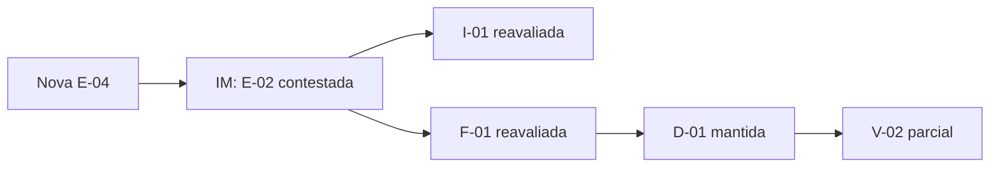
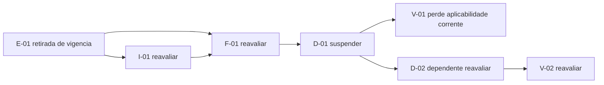
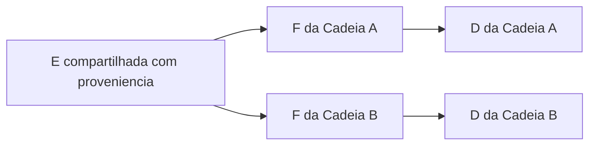
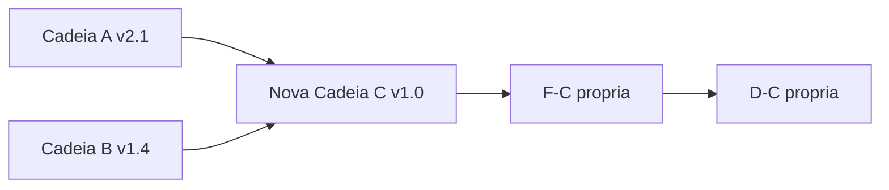

# GP-RG-04 — Modelo De Propagacao Da GDC-R

## 1. Objetivo

Definir como eventos e alteracoes percorrem dependencias da GDC-R, quais elementos exigem reavaliacao e como preservar integridade, historico e independencia de dominio durante evolucao normal, revisoes, conflitos, paralelismo e convergencia.

## 2. Principio Central

Propagacao e **calculo documental de alcance**, nao mudanca automatica de validade.

Uma alteracao em elemento antecedente:

1. registra evento EV;
2. identifica dependencias;
3. cria Registros de Impacto IM;
4. obriga reavaliacao conforme forca/criticidade;
5. pode suspender aplicabilidade;
6. somente altera F ou D por sucessor documentado e autoridade aplicavel.

## 3. Modelo De Dependencia

Cada dependencia ativa possui a tupla:

`DEP = (origem, destino, relacao, necessidade, forca, distancia, criticidade, escopo, versao)`

### 3.1 Necessidade

| Classe | Definicao |
|---|---|
| `OBRIGATORIA` | ausencia viola cardinalidade/regra de integridade |
| `OPCIONAL` | pode estar ausente sem nao conformidade, mas se utilizada deve ser rastreada |

### 3.2 Forca

| Classe | Definicao | Consequencia de alteracao |
|---|---|---|
| `FORTE` | destino nao conserva suporte ou significado declarado sem a origem | reavaliacao obrigatoria; pode suspender destino |
| `FRACA` | origem contextualiza ou complementa, mas sua mudanca nao retira necessariamente suporte minimo | avaliacao de impacto obrigatoria; reavaliacao do conteudo conforme relevancia |

### 3.3 Distancia

| Classe | Definicao |
|---|---|
| `DIRETA` | uma aresta liga origem e destino |
| `TRANSITIVA` | destino e alcancado por duas ou mais arestas ativas |

Toda dependencia transitiva herda o caminho completo. Sua forca efetiva nao pode ser maior que a justificavel pelo elo mais fraco sem fundamentacao adicional.

### 3.4 Criticidade

| Classe | Definicao | Consequencia |
|---|---|---|
| `CRITICA` | falha remove suporte minimo, viola invariante bloqueante ou afeta D de impacto material | K=INSTAVEL; D pode ser suspensa; R obrigatorio |
| `NAO_CRITICA` | falha permite continuidade com observacao/ressalva | IM e tratamento proporcional |

Criticidade e ortogonal a forca: uma dependencia pode ser forte e nao critica quando existem suportes fortes redundantes.

## 4. Classificacao Inicial Das Relacoes GDC-R

| Relacao | Necessidade tipica | Forca inicial | Criticidade inicial | Observacao |
|---|---|---|---|---|
| AR-01 P→I `CONDICIONA` | opcional | forte se I declara depender de P | contextual | classificar na instancia |
| AR-02 E→I `SUPORTA` | obrigatoria | forte | critica se ultima E valida | toda I exige ao menos uma E |
| AR-03 P→F `COMPOE` | opcional | forte ou fraca | depende do papel da P | declarar materialidade |
| AR-04 E→F `COMPOE` | obrigatoria | forte | critica se ultimo suporte E | toda F exige E |
| AR-05 I→F `COMPOE` | opcional | forte quando usada como razao central | depende de redundancia | F deve indicar peso/papel sem fingir metrica universal |
| AR-06 F→D `FUNDAMENTA` | obrigatoria | forte | critica se ultima F suficiente | toda D exige F |
| AR-07 D→V `SUBMETE` | obrigatoria para V | forte | critica para V concluida | V sem D e invalida |
| AR-08 V→E `PRODUZ` | obrigatoria para V concluida | forte | critica | resultado observavel requerido |
| AR-09/10 `CONFIRMA/CONTESTA` | opcional | fraca ate analise | pode tornar-se critica | nao muda estado automaticamente |
| AR-11 a AR-15 revisao | obrigatoria quando aplicavel | forte | critica para historico | predecessor/sucessor/R |
| AR-16 conflito | obrigatoria quando conflito existe | forte para visibilidade | critica se afeta suporte | ocultacao e bloqueante |
| AR-17 refinamento | opcional | fraca; I sucessora exige E propria | nao critica por padrao | nao substitui AR-02 |
| AR-18 alternativa | opcional quando nao razoavel; obrigatoria quando razoavel | fraca/forte conforme materialidade | pode ser critica | omissao material viola governanca |
| AR-19 compartilhamento | opcional | conforme relacao importada | depende da proveniencia | origem preservada |
| AR-20 dependencia entre D | opcional | forte se D destino depende da origem | pode ser critica | nao substitui F→D |

As classificacoes sao defaults documentais. A instancia deve justificar desvios. Sua eficacia ainda nao foi validada.

## 5. Intensidade De Impacto

| Nivel | Nome | Efeito minimo |
|---|---|---|
| `IM-0` | `SEM_IMPACTO` | justificativa de nao impacto; destino permanece |
| `IM-1` | `OBSERVAR` | registrar ressalva/monitoramento; sem suspensao |
| `IM-2` | `REAVALIAR` | destino deve ser examinado e nao pode ser promovido/consolidado |
| `IM-3` | `SUSPENDER_APLICABILIDADE` | uso corrente do destino e interrompido ate resolucao |
| `IM-4` | `RETIRAR_SUPORTE_ATUAL` | estado vigente perde suporte; sucessor ou encerramento requerido |
| `IM-X` | `INCONCLUSIVO` | evidencia nao permite graduar; aplicar tratamento conservador fundamentado |

O nivel e atribuido por caminho, nao apenas por tipo de no. Conflitos entre niveis permanecem visiveis.

## 6. Algoritmo Documental De Propagacao

1. registrar EV e elemento inicial;
2. verificar se a alteracao e adicao, contestacao, retirada de vigencia, substituicao ou conflito;
3. congelar snapshot anterior;
4. abrir R para mudanca material;
5. enumerar arestas de saida ativas;
6. classificar DEP de cada aresta;
7. criar IM direto para cada destino;
8. percorrer transitivamente dependentes ate D/V ou limite de escopo;
9. detectar caminhos alternativos/redundantes;
10. verificar se algum invariante perde atendimento;
11. marcar elementos `NAO_AFETADO`, `EM_OBSERVACAO`, `EM_REAVALIACAO`, `SUSPENSO` ou `SEM_SUPORTE_ATUAL`;
12. recompor sucessores de I/F/D/V quando necessario;
13. reexecutar invariantes e classificar Ω;
14. publicar snapshot sucessor com mapa completo;
15. encerrar R ou declarar pendencia.

Parada da propagacao e permitida somente quando IM-0 e justificado, o limite de escopo e atingido ou um elemento terminal e alcançado. A parada nao pode ocultar dependencia transitiva material.

## 7. Matriz De Propagacao Por Alteracao

| Alteracao | Reavaliacao direta obrigatoria | Reavaliacao transitiva potencial | Efeito minimo |
|---|---|---|---|
| nova Premissa | I e F que a adotam; conflitos com P existentes | D/V dependentes | IM-1 ou maior conforme materialidade |
| Premissa rejeitada/substituida | todas I/F com P→I/P→F ativa | D e V alcançaveis | IM-2; IM-3 se critica |
| nova Evidencia | I/F relevantes e conflitos com E existentes | D/V que usam esses caminhos | IM-1; nova E nao invalida automaticamente |
| Evidencia contestada | I/F que dependem dela | D/V alcançaveis | IM-2; verificar redundancia |
| retirada de vigencia de Evidencia | todas I/F dependentes | D/V | IM-3/4 se ultimo suporte; historico preservado |
| nova Inferencia | F que a incorporam ou devem comparar alternativas | D/V | IM-1/2 |
| Inferencia revisada/rejeitada | F dependentes | D/V | IM-2; IM-3 se suporte central |
| nova Fundamentacao | D candidata e D/F conflitantes | V e D dependentes | exige ato decisorio para mudar D |
| Fundamentacao insuficiente | D fundamentadas | V e D dependentes | D `EM_REAVALIACAO`; suspender se ultima F |
| nova Decisao | V e D dependentes; D anteriores do mesmo compromisso | cadeias que compartilham D | mapear sucessao/compatibilidade |
| Decisao revista/revogada | V e D dependentes | cadeias consumidoras | versao maior; D anterior preservada |
| nova Validacao | E de resultado e conflitos com V existentes | I/F/D do ciclo seguinte | Q atualizado em nova versao |
| Validacao negativa/inconclusiva | E de resultado e R | I/F/D aplicaveis | IM-2 ou maior; nunca apagar D/V |

“Retirada” significa desativacao de vigencia. Exclusao fisica/historica e proibida.

## 8. Matriz De Reavaliacao Obrigatoria

Legenda: `O` obrigatoria; `C` condicional a relevancia/caminho; `—` nao direta.

| Origem alterada | P | E | I | F | D | V |
|---|---:|---:|---:|---:|---:|---:|
| P | C | — | O se dependente | O se dependente | C transitiva | C transitiva |
| E | C por confirma/contesta | C por conflito | O se dependente | O se dependente | C transitiva | C transitiva |
| I | — | — | C por refinamento/conflito | O se dependente | C transitiva | C transitiva |
| F | — | — | — | C por conflito | O se dependente | C transitiva |
| D | — | — | — | C se escopo mudar | O por revisao/dependencia | O se dependente |
| V | — | O para resultado | C no novo ciclo | C no novo ciclo | C no novo ciclo | C por conflito/revalidacao |

## 9. Redundancia E Isolamento

Multiplos suportes nao eliminam propagacao. Eles podem reduzir criticidade se:

* sao independentes e nao copias da mesma origem;
* possuem escopo compativel;
* permanecem ativos;
* a F declara que o suporte remanescente e suficiente;
* a decisao de suficiencia e auditavel.

Falha localizada pode ser isolada quando nenhum caminho forte/critico conecta o elemento a D vigente. O isolamento gera IM-0/1 fundamentado e preserva a falha no historico.

## 10. Propagacao De Conflitos

### 10.1 Evidencias

E conflitantes propagam `EM_REAVALIACAO` a I/F que dependem da proposicao em disputa. Estrategias candidatas: repetir coleta, comparar metodo, separar escopos, manter ambas ou buscar fonte adicional.

### 10.2 Inferencias

I conflitantes obrigam F a representar alternativas, premissas e confiancas. Estrategias candidatas: revisao independente, decomposicao de escopo ou nova E.

### 10.3 Fundamentacoes

F conflitantes propagam conflito a D candidata/vigente. Estrategias candidatas: decisao fundamentada de precedencia, decomposicao da D, manutencao de alternativas ou suspensao.

### 10.4 Decisoes

D conflitantes exigem comparar autoridade, escopo, dependencia e ordem logica. Estrategias candidatas: coexistencia segmentada, sucessao, revisao ou suspensao.

### 10.5 Validacoes

V conflitantes exigem comparar D/versao, metodo, amostra e limites. Estrategias candidatas: revalidacao, separacao de escopo, terceira V ou conclusao inconclusiva.

Nenhuma estrategia e universal ou definitiva nesta GP.

## 11. Exemplo 1 — Evolucao Normal

Cadeia abstrata e neutra de dominio:

1. v0.1 cria M e P-01;
2. v0.2 adiciona E-01/E-02;
3. v0.3 cria I-01 e F-01;
4. v0.4 registra D-01;
5. v0.5 registra V-01 e E-03 de resultado;
6. v0.6 encerra com `Ω=(ENCERRADA, VALIDADA_APROVADA, ESTAVEL, CONFORME)`;
7. v0.7 arquiva sem alterar conteudo.

Nao ha R material; cada snapshot e preservado.

## 12. Exemplo 2 — Revisao Parcial

Evento: nova E-04 limita uma das tres E usadas por F-01.

Existem E-01/E-03 independentes suficientes; F-02 documenta a limitacao e mantem D-01. Versao `v0.6→v0.7`, compatibilidade `COMPATIVEL_COM_RESSALVAS`. A suficiencia remanescente e hipotetica no exemplo, nao regra universal.

## 13. Exemplo 3 — Revisao Total

Evento: E critica unica perde vigencia.

1. EV registra retirada de vigencia sem excluir E historica;
2. I-01 fica `SEM_SUPORTE_ATUAL`;
3. F-01 fica insuficiente;
4. D-01 e suspensa;
5. K torna-se `INSTAVEL`, L torna-se `EM_REVISAO`;
6. nova E-02 gera I-02 e F-02;
7. autoridade revoga D-01 e registra D-02;
8. nova V-02 e exigida;
9. versao passa de `v1.x` para `v2.0`, `INCOMPATIVEL` quanto ao compromisso anterior.

## 14. Exemplo 4 — Conflito

Duas evidencias independentes E-A e E-B sustentam I-A e I-B incompatíveis. O modelo:

* cria AR-16 entre registros conflitantes;
* propaga IM-2 as F dependentes;
* impede K=`ESTAVEL`;
* preserva ambas;
* permite estrategias candidatas sem escolher uma automaticamente;
* encerra como inconclusiva se o conflito nao puder ser resolvido.

## 15. Exemplo 5 — Propagacao Em Multiplos Niveis

Cada salto possui IM e caminho. O alcance termina apenas apos todos os dependentes transitivos materiais serem classificados.

## 16. Exemplo 6 — Cadeias Paralelas

Se E0 for contestada, ambas recebem EV/IM proprios. A suspensao de D-A nao suspende D-B automaticamente: criticidade e suportes de cada cadeia sao avaliados separadamente.

## 17. Exemplo 7 — Cadeias Convergentes

Convergencia:

1. nao altera A ou B;
2. cria M-C;
3. referencia versoes exatas;
4. importa elementos com proveniencia;
5. registra conflitos e exclusoes;
6. cria F-C e D-C;
7. declara compatibilidade;
8. exige V-C.

## 18. Propriedades Verificadas Pelo Desenho

O modelo fornece estruturas para:

* persistencia por snapshots;
* propagacao por DEP/IM;
* resiliencia por isolamento;
* recuperabilidade por predecessores;
* observabilidade por EV/R/IM;
* evolutividade por versoes;
* estabilidade por K;
* consistencia temporal por ordem logica.

“Fornece estruturas” nao significa que as propriedades foram demonstradas empiricamente.

## 19. Invariantes De Propagacao

1. nenhuma propagacao sem EV;
2. nenhum destino afetado sem IM;
3. toda dependencia forte alterada e reavaliada;
4. toda dependencia transitiva material possui caminho completo;
5. criticidade e declarada por instancia;
6. redundancia nao e presumida;
7. retirada de vigencia nao exclui historia;
8. D nao e revogada automaticamente;
9. parada de propagacao e justificada;
10. cadeias paralelas mantem estados independentes;
11. convergencia cria nova identidade;
12. conflitos permanecem observaveis;
13. extensoes preservam DGA-01;
14. conceito experimental nao integra o grafo oficial.

## 20. Limitacoes

* classificacoes de dependencia e impacto nao foram calibradas;
* o algoritmo nao foi aplicado por avaliadores independentes;
* simultaneidade de eventos pode exigir ordenacao adicional;
* redundancia e criticidade dependem de dominio, embora a estrutura seja neutra;
* exemplos nao constituem experimentos;
* nenhum mecanismo de software foi definido;
* custo de propagacao em grafos grandes e desconhecido.

## 21. Estado Final

**MODELO DE PROPAGACAO GDC-R FORMALIZADO — COMPORTAMENTO EMPIRICO PENDENTE**
