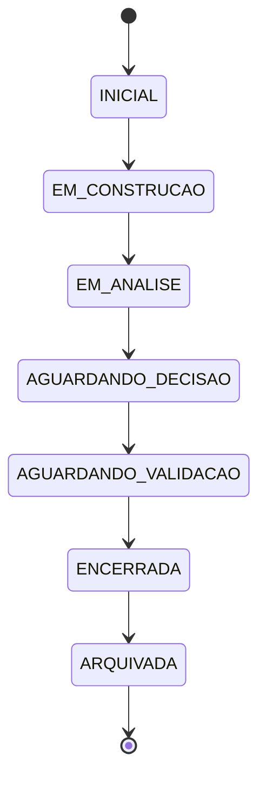
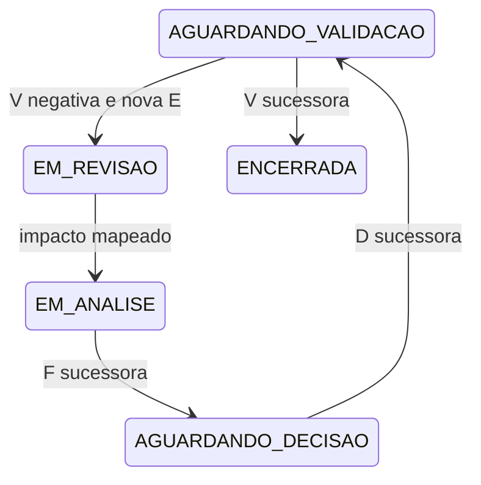

# GP-RG-04 — Maquina De Estados Da GDC-R

## 1. Objetivo

Formalizar estados, transicoes, pre-condicoes, efeitos e encerramentos de uma cadeia GDC-R ao longo de versoes. A maquina e documental, independente de dominio e nao executavel.

## 2. Modelo De Estado

O estado completo e `Ω=(L,Q,K,X)`, conforme `RG_04_DYNAMIC_MODEL.md`:

* `L`: ciclo de vida;
* `Q`: verificacao/validacao;
* `K`: estabilidade;
* `X`: conformidade.

As dimensoes sao ortogonais, mas sujeitas a restricoes de coerencia. Exemplo valido: `(ENCERRADA, VALIDADA_COM_RESSALVAS, CONSOLIDADA, CONFORME_COM_RESSALVAS)`. Exemplo invalido: `(EM_REVISAO, VALIDADA_APROVADA, ESTAVEL, CONFORME)` quando a revisao critica afeta a validacao vigente.

## 3. Registro De Transicao

Toda transicao `T: Ωa → Ωb` exige:

* `transition_id`;
* snapshot de origem e destino;
* evento EV e origem observavel;
* estado anterior e posterior;
* autoridade;
* justificativa;
* dependencias afetadas;
* necessidade de R, F, D e V novas;
* mapa de impacto IM;
* classe de compatibilidade;
* limitacoes e pendencias.

Toda transicao preserva historico. “Sem R” nas matrizes significa que a transicao prevista pode ser registrada no historico normal; nunca significa mudanca silenciosa.

## 4. Transicoes Do Ciclo De Vida

| ID | Origem `L` | Destino `L` | Gatilho/pre-condicao | Exige R? | Exige nova F/D? | Efeito sobre D anterior |
|---|---|---|---|---:|---|---|
| TL-01 | `INICIAL` | `EM_CONSTRUCAO` | Manifesto aprovado e trabalho aberto | nao | nao | nao aplicavel |
| TL-02 | `INICIAL` | `SUSPENSA` | bloqueio de autoridade, escopo ou entrada | sim | nao | nao aplicavel |
| TL-03 | `INICIAL` | `ENCERRADA` | cancelamento ou ausencia de escopo fundamentada | sim | D de nao acao quando aplicavel | nenhuma D anterior |
| TL-04 | `EM_CONSTRUCAO` | `EM_ANALISE` | estrutura minima declarada para o perfil | nao | nao | nenhuma mudanca |
| TL-05 | `EM_CONSTRUCAO` | `EM_REVISAO` | elemento construido e contestado/materialmente alterado | sim | conforme impacto | D inexistente ou preservada |
| TL-06 | `EM_CONSTRUCAO` | `SUSPENSA` | bloqueio material | sim | nao | D, se houver, fica suspensa quanto a aplicabilidade afetada |
| TL-07 | `EM_CONSTRUCAO` | `ENCERRADA` | abandono justificado ou impossibilidade | sim | D de encerramento quando aplicavel | nenhuma D pode ser presumida |
| TL-08 | `EM_ANALISE` | `EM_CONSTRUCAO` | lacuna exige coleta/modelagem adicional | sim se material | nao necessariamente | D vigentes entram em observacao se afetadas |
| TL-09 | `EM_ANALISE` | `AGUARDANDO_DECISAO` | F suficiente no escopo e conflitos materiais tratados | nao | F deve existir; D ainda nao | nenhuma mudanca |
| TL-10 | `EM_ANALISE` | `EM_REVISAO` | conflito, nova informacao ou falha de integridade | sim | conforme impacto | D afetada fica em revisao/suspensa |
| TL-11 | `EM_ANALISE` | `SUSPENSA` | conflito critico ou impossibilidade de prosseguir | sim | nao | aplicabilidade afetada suspensa |
| TL-12 | `AGUARDANDO_DECISAO` | `AGUARDANDO_VALIDACAO` | D formalmente registrada | nao | F existente e D nova obrigatoria | D torna-se vigente no escopo |
| TL-13 | `AGUARDANDO_DECISAO` | `EM_REVISAO` | F contestada, nova alternativa ou autoridade solicita revisao | sim | F nova/revista; D se mudar escolha | nenhuma D nova ate ato formal |
| TL-14 | `AGUARDANDO_DECISAO` | `SUSPENSA` | autoridade ausente ou conflito critico | sim | nao | proposta nao se torna D |
| TL-15 | `AGUARDANDO_DECISAO` | `ENCERRADA` | D governada de nao agir | sim | F e D de nao acao | encerra compromisso no escopo |
| TL-16 | `AGUARDANDO_VALIDACAO` | `ENCERRADA` | V concluida ou impossibilidade final declarada | sim para resultado material | V obrigatoria, salvo pendencia final justificada | D mantida, rejeitada no resultado ou encerrada; historico preservado |
| TL-17 | `AGUARDANDO_VALIDACAO` | `EM_REVISAO` | V negativa/inconclusiva, nova E/P ou mudanca de escopo | sim | F/D novas se suporte ou compromisso mudar | D fica `EM_REAVALIACAO`; nao e apagada |
| TL-18 | `AGUARDANDO_VALIDACAO` | `SUSPENSA` | validacao temporariamente impossivel ou risco critico | sim | nao | aplicabilidade pode ser suspensa |
| TL-19 | `EM_REVISAO` | `EM_ANALISE` | sucessores produzidos e impacto mapeado | sim, encerramento de R | F/D conforme impacto | D antiga mantida, suspensa, superada ou revogada por registro |
| TL-20 | `EM_REVISAO` | `EM_CONSTRUCAO` | revisao maior exige recomposicao estrutural | sim | posteriormente | D vigente fica suspensa se suporte critico mudou |
| TL-21 | `EM_REVISAO` | `AGUARDANDO_DECISAO` | F recomposta e pronta; nova D pendente | sim | F nova obrigatoria | D anterior permanece historica; aplicabilidade declarada |
| TL-22 | `EM_REVISAO` | `SUSPENSA` | conflito/entrada impede concluir R | sim | nao | D afetada suspensa |
| TL-23 | `EM_REVISAO` | `ENCERRADA` | revisao conclui rejeicao, inconclusao ou nao conformidade final | sim | D de encerramento quando aplicavel | D anterior encerrada/revogada/superada formalmente |
| TL-24 | `SUSPENSA` | estado ativo anterior | bloqueio resolvido e retomada autorizada | sim | conforme mudancas durante suspensao | reavaliar vigencia antes de reativar D |
| TL-25 | `SUSPENSA` | `ENCERRADA` | bloqueio definitivo ou decisao de nao retomar | sim | F/D de encerramento quando aplicavel | D afetada encerrada ou revogada formalmente |
| TL-26 | `ENCERRADA` | `ARQUIVADA` | custodia e somente leitura aprovadas | nao material; registrar transicao | nao | D permanece historica |
| TL-27 | `ENCERRADA` | `OBSOLETA` | perda de atualidade ou aplicabilidade documentada | sim | nao; justificativa obrigatoria | D perde recomendacao corrente, nao existencia historica |
| TL-28 | `ENCERRADA` | `SUBSTITUIDA` | sucessora identificada e mapa de compatibilidade completo | sim | F/D pertencem a sucessora | D anterior torna-se superada no escopo sucessor |

## 5. Estados Terminais

`ARQUIVADA`, `OBSOLETA` e `SUBSTITUIDA` nao aceitam mutacao de conteudo. Nova informacao gera:

* anotacao custodial que nao altera significado; ou
* cadeia/versao sucessora com vinculo ao terminal.

`ENCERRADA` e semiterminal: somente pode transitar para um estado terminal de custodia/aplicabilidade ou originar sucessora. Nao retorna diretamente a estado ativo.

## 6. Transicoes Da Dimensao De Verificacao

| ID | Origem `Q` | Destino `Q` | Requisito | Efeito |
|---|---|---|---|---|
| TQ-01 | `NAO_AVALIADA` | `PARCIALMENTE_VALIDADA` | V concluida para subconjunto delimitado | restante permanece explicitamente nao avaliado |
| TQ-02 | `NAO_AVALIADA` | `VALIDADA_APROVADA` | V completa aprovada | validade restrita a escopo/versao |
| TQ-03 | `NAO_AVALIADA` | `VALIDADA_COM_RESSALVAS` | V completa com limites materiais | ressalvas tornam-se dependencias de acompanhamento |
| TQ-04 | `NAO_AVALIADA` | `VALIDADA_REJEITADA` | V completa negativa | abre R quando D/resultado exigir revisao |
| TQ-05 | `NAO_AVALIADA` | `VALIDACAO_INCONCLUSIVA` | evidencia insuficiente/conflitante | nao converter em aprovacao/rejeicao |
| TQ-06 | `NAO_AVALIADA` | `VERIFICADA_SEM_ACAO` | D de nao acao e cumprimento verificado | nao generaliza acerto da escolha |
| TQ-07 | `PARCIALMENTE_VALIDADA` | qualquer resultado completo | V cobre o restante e integra resultados | conflitos entre V devem ser preservados |
| TQ-08 | resultado concluido | novo resultado em sucessora | revalidacao AR-13 e nova E | resultado anterior permanece historico |

Nao e permitida transicao direta entre resultados concluidos no mesmo snapshot. Mudanca exige nova V, nova versao e compatibilidade declarada.

## 7. Transicoes Da Dimensao De Estabilidade

| ID | Origem `K` | Destino `K` | Condicao |
|---|---|---|---|
| TK-01 | `INSTAVEL` | `EM_OBSERVACAO` | bloqueios resolvidos; pendencias nao criticas permanecem |
| TK-02 | `INSTAVEL` | `ESTAVEL` | todos os criterios de estabilidade atendidos e auditados |
| TK-03 | `EM_OBSERVACAO` | `ESTAVEL` | pendencias materiais encerradas |
| TK-04 | `EM_OBSERVACAO` | `INSTAVEL` | surge conflito critico, R material ou dependencia rompida |
| TK-05 | `ESTAVEL` | `EM_OBSERVACAO` | nova informacao relevante sem perda imediata de suporte |
| TK-06 | `ESTAVEL` | `INSTAVEL` | perda critica ou violacao bloqueante |
| TK-07 | `ESTAVEL` | `CONGELADA` | decisao formal de baseline/custodia |
| TK-08 | `ESTAVEL` | `CONSOLIDADA` | L=ENCERRADA, auditoria concluida e designacao formal |
| TK-09 | `CONGELADA` | estado de sucessora | nova informacao exige ramo ou versao nova |
| TK-10 | `CONSOLIDADA` | estado de sucessora | conhecimento novo gera sucessora; consolidada permanece |

E proibido declarar `ESTAVEL` ou `CONSOLIDADA` com R critico aberto, conflito material oculto ou dependencia forte rompida.

## 8. Transicoes De Conformidade

`X` pode melhorar ou deteriorar somente em novo snapshot com auditoria registrada.

| Mudanca | Requisito |
|---|---|
| `INCOMPLETA` → `CONFORME_COM_RESSALVAS/CONFORME` | lacunas obrigatorias resolvidas e invariantes reexecutados |
| `INCONSISTENTE` → classe conforme | conflitos tratados e estados compatibilizados |
| `NAO_CONFORME` → classe superior | todas as violacoes bloqueantes corrigidas em sucessora |
| classe conforme → inferior | nova falha, evidencia ou conflito documentado |

Uma versao historica nao muda de classe retrospectivamente; a nova classe pertence a nova versao.

## 9. Quando Nova Fundamentacao E Obrigatoria

Nova F ou versao sucessora de F e obrigatoria quando:

1. uma E que compoe F perde vigencia, origem ou confiabilidade material;
2. I usada por F e revisada/rejeitada;
3. P material e rejeitada/substituida;
4. alternativa razoavel nova altera a comparacao;
5. risco, impacto ou escopo material muda;
6. conflito de F e resolvido ou reclassificado;
7. D sera revisada, revogada ou substituida;
8. revisao maior e aberta.

Acrescimo puramente editorial, sem mudanca semantica e com verificacao registrada, pode dispensar nova F e gerar revisao menor.

## 10. Quando A Aplicabilidade De Decisao Muda

Nenhuma transicao apaga uma D. O estado de aplicabilidade pode ser:

`PROPOSTA`, `VIGENTE`, `EM_REAVALIACAO`, `SUSPENSA`, `REVOGADA`, `SUPERADA` ou `ENCERRADA`.

| Evento | Efeito minimo |
|---|---|
| perda de dependencia fraca | D permanece vigente; impacto registrado |
| perda de dependencia forte nao critica | D entra `EM_REAVALIACAO` |
| perda do ultimo suporte critico | D entra `SUSPENSA`; cadeia K=INSTAVEL |
| V negativa material | D entra `EM_REAVALIACAO` ou `SUSPENSA` conforme risco |
| nova D mantem compromisso | D anterior `ENCERRADA` ou `SUPERADA`, com AR-12 |
| nova D muda/revoga compromisso | D anterior `REVOGADA` ou `SUPERADA`; nova F obrigatoria |

Somente ato decisorio formal com F atualizada revoga ou substitui aplicabilidade. Evidencia, Inferencia ou Validacao isolada apenas dispara reavaliacao/suspensao conforme criticidade.

## 11. Transicoes Proibidas

| ID | Transicao proibida | Motivo |
|---|---|---|
| TP-01 | qualquer estado → outro sem EV/origem | mudanca nao observavel |
| TP-02 | snapshot publicado → mutacao in-place | viola imutabilidade |
| TP-03 | `INICIAL` → `VALIDADA_APROVADA` | faltam cadeia, D e V |
| TP-04 | `EM_CONSTRUCAO` → `CONSOLIDADA` | faltam encerramento e auditoria |
| TP-05 | `EM_REVISAO` critico → `ESTAVEL` sem encerrar R | inconsistencia |
| TP-06 | resultado Q concluido → outro no mesmo snapshot | sobrescrita de V |
| TP-07 | terminal → estado ativo na mesma versao | terminalidade violada |
| TP-08 | D vigente → revogada sem F/ato decisorio | invalidacao automatica |
| TP-09 | `NAO_CONFORME` → `CONFORME` sem nova versao/auditoria | reclassificacao sem evidencia |
| TP-10 | cadeia fonte → convergente por fusao destrutiva | perde proveniencia |
| TP-11 | `Criterio de Avaliacao` externo → tipo oficial | promocao indevida |
| TP-12 | estado/transicao dependente de dominio, tecnologia ou agente | viola DGA-01 |

## 12. Exemplo De Trajetoria Normal

Exemplo de estados compostos:

1. `(INICIAL, NAO_AVALIADA, INSTAVEL, INCOMPLETA)`;
2. `(EM_CONSTRUCAO, NAO_AVALIADA, EM_OBSERVACAO, INCOMPLETA)`;
3. `(EM_ANALISE, NAO_AVALIADA, EM_OBSERVACAO, CONFORME_COM_RESSALVAS)`;
4. `(AGUARDANDO_DECISAO, NAO_AVALIADA, ESTAVEL, CONFORME)`;
5. `(AGUARDANDO_VALIDACAO, NAO_AVALIADA, EM_OBSERVACAO, CONFORME)`;
6. `(ENCERRADA, VALIDADA_APROVADA, ESTAVEL, CONFORME)`;
7. `(ARQUIVADA, VALIDADA_APROVADA, CONSOLIDADA, CONFORME)`.

Os valores sao ilustrativos e nao resultado experimental.

## 13. Exemplo De Revisao

O snapshot anterior conserva `(AGUARDANDO_VALIDACAO, VALIDADA_REJEITADA, INSTAVEL, CONFORME_COM_RESSALVAS)`; a sucessora nao o reescreve.

## 14. Invariantes De Transicao

1. origem e destino sempre identificados;
2. nenhuma transicao sem evento;
3. nenhuma transicao material sem mapa de impacto;
4. nenhum resultado Q sem V;
5. nenhuma mudanca de D vigente sem F atualizada e ato formal;
6. nenhuma retomada de suspensao sem reavaliar mudancas ocorridas;
7. nenhuma consolidacao sem estabilidade e encerramento;
8. nenhum estado terminal mutavel;
9. toda sucessao preserva predecessor;
10. nenhuma dimensao contradiz outra sem estado `INCONSISTENTE`;
11. toda classificacao e limitada ao snapshot;
12. DGA-01 se aplica a todo estado e transicao.

## 15. Limitacoes

* estados compostos nao foram aplicados por terceiros;
* transicoes podem exigir extensoes para concorrencia real;
* catalogo nao modela tempo continuo nem distribuicao de autoridade;
* criterios de estabilidade nao foram calibrados;
* exemplos sao abstratos;
* a maquina nao constitui protocolo experimental.

## 16. Estado Final

**MAQUINA DE ESTADOS GDC-R FORMALIZADA — TRANSICOES NAO VALIDADAS EMPIRICAMENTE**
